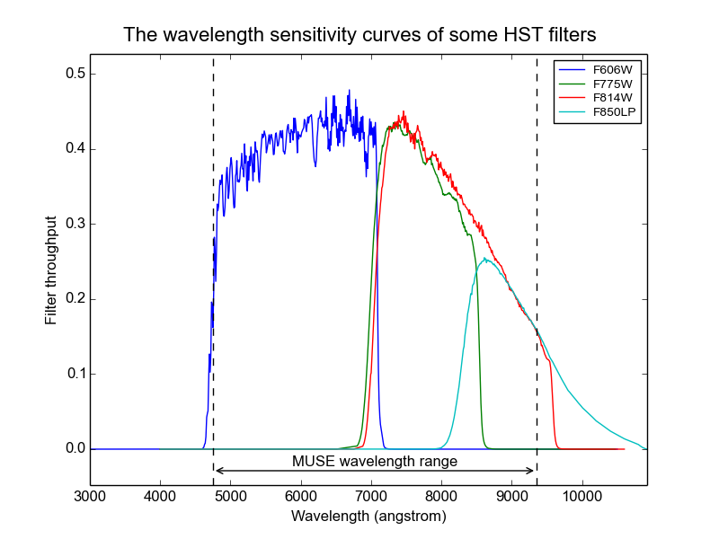

.. _make_wideband_image:

Obtaining a MUSE image with a given bandpass
============================================

The photometry fitting algorithms are designed to compare MUSE and HST
images that have similar wavelength sensitivity curves. Each MUSE
observation generates a cube of 3681 narrow-band images, at wavelength
intervals of 1.25 angstroms, whereas each HST image has an effective
bandwidth of hundreds of angstroms and a non-flat wavelength response
curve. To generate a MUSE image that has the same spectral
characteristics as an HST image, the narrow band images of the MUSE
cube have to be combined, weighted by the spectral-sensitivity curve
of the HST image. This can be done using the
:ref:`make_wideband_image<make_wideband_image>` script.

The :ref:`make_wideband_image<make_wideband_image>` script takes a
MUSE cube and a filter curve and generates a wide-band MUSE image that
has the spectral response of the filter curve.

The arguments of the function can be obtained by running it with the
``-h`` option::

  % make_wideband_image -h
  usage: make_wideband_image [-h] [--prefix [output-prefix]] [--quiet]
                             [--wave_units [wavelength-units]]
                             filter_curve muse_cubes [muse_cubes ...]

  positional arguments:
    filter_curve          The filename of the wavelength sensitivity curve of
                          the camera. The file should be a text file with two
                          columns of numbers. The first column are the filter-
                          curve wavelengths, and the second are the
                          corresponding sensitivities, which should be unit-
                          less. The sensitivities will be normalized by the area
                          under the sensitivity curve, so only their relative
                          values are important.
    muse_cubes            The filenames of a MUSE cubes to be processed.

  optional arguments:
    -h, --help            show this help message and exit
    --prefix [output-prefix]
                          When this option used, it specifies a prefix to use
                          when constructing the names of the output FITS files.
                          The output files are then named,
                          "<prefix>_<input_name>", where <prefix> is the
                          specified string, and <input_name> is the base-name of
                          the input cube, but with the first instance of either,
                          "datacube" or "cube", replaced with "image". When this
                          option is omitted, the prefix defaults to the base-
                          name of the filter file.
    --quiet               Suppress the messages that report each step as it is
                          performed.
    --wave_units [wavelength-units]
                          DEFAULT=Angstrom. The units of the wavelengths in the
                          file of sensitivity versus wavelength. If this option
                          is not specified, angstroms are assumed.
  %

For example, the following command takes the cube of a MUSE
observation of the MUSE UDF08 field, and creates an image that has the
same spectral characteristics as the HST ACS with the HST F606W
imaging filter::

  % make_wideband_image wfc_F606W.dat DATACUBE-MUSE*.fits
  Reading filter: wfc_F606W.dat
  Reading cube: DATACUBE-MUSE.2014-09-21T07:12:55.019.fits
  Computing the output image.
  [WARNING] 1.1% of the integrated filter curve is beyond the edges of the cube.
  Writing image to: wfc_F606W_IMAGE-MUSE.2014-09-21T07:12:55.019.fits
  WARNING: VerifyWarning: Card is too long, comment will be truncated. [astropy.io.fits.card]
  Reading cube: DATACUBE-MUSE.2014-09-21T07:39:42.019.fits
  Computing the output image.
  [WARNING] 1.1% of the integrated filter curve is beyond the edges of the cube.
  Writing image to: wfc_F606W_IMAGE-MUSE.2014-09-21T07:39:42.019.fits
  %

Note the warning message that says that 1.1% of the integrated filter
curve lies beyond the edges of the cube. The reported number is the
fraction of the area under the filter curve that is outside the
wavelength coverage of the MUSE cube. The warning can safely be
ignored if the percentage is low, but larger percentages will yield a
wide-band image whose spectral response curve is not a good
approximation of the filter curve, and the photometry fits will yield
large residuals for sources that have significant spectral indexes.

Also note that the name of each output file is based on the name of
the corresponding input CUBE. By default the output filename is the
concatenation of the filter-curve filename (minus its extension), and
the input CUBE filename. To avoid creating a filename that implies
that a cube has been created, any initial instance of the word
datacube or cube in the output filename is automatically replaced with
the word, image.

Performing the same operation from a python script
--------------------------------------------------

Arbitrary python scripts can obtain the same result as the
:ref:`make_wideband_image<make_wideband_image>` script as follows::

  from mpdaf.obj import Cube
  import numpy as np
  cube = Cube(hst_filename)
  w, s = np.hsplit(np.loadtxt(bandpass_filename, usecols=(0,1)), 2)
  cube.bandpass_image(wavelengths=w, sensitivities=s, unit_wave=u.angstrom)

.. _hst_filter_curves:

HST filter curves
-----------------

Filter curves for HST filters that overlap the wavelength coverage of
the MUSE cube, can be found at the following URL:

 http://www.stsci.edu/hst/acs/analysis/throughputs

For HST UDF observations, the pertinent filters are the following ACS
WCS filters:

.. _wfc_F606W.dat: http://www.stsci.edu/hst/acs/analysis/throughputs/tables/wfc_F606W.dat
.. _wfc_F775W.dat: http://www.stsci.edu/hst/acs/analysis/throughputs/tables/wfc_F775W.dat
.. _wfc_F814W.dat: http://www.stsci.edu/hst/acs/analysis/throughputs/tables/wfc_F814W.dat
.. _wfc_F850LP.dat: http://www.stsci.edu/hst/acs/analysis/throughputs/tables/wfc_F850LP.dat

+-------------+----------------+-----------------+
| Filter name | Filter overlap | Filter curve    |
+=============+================+=================+
|  F606W      |      99%       | wfc_F606W.dat_  |
+-------------+----------------+-----------------+
|  F775W      |     100%       | wfc_F775W.dat_  |
+-------------+----------------+-----------------+
|  F814W      |      96%       | wfc_F814W.dat_  |
+-------------+----------------+-----------------+
|  F850LP     |      73%       | wfc_F850LP.dat_ |
+-------------+----------------+-----------------+

The *filter overlap* column indicates how much of the integrated
bandpass lies within the MUSE wavelength range. The response curves of
these filters are shown in the following figure. Note the two vertical
lines that delimit the wavelength coverage of MUSE cubes.

