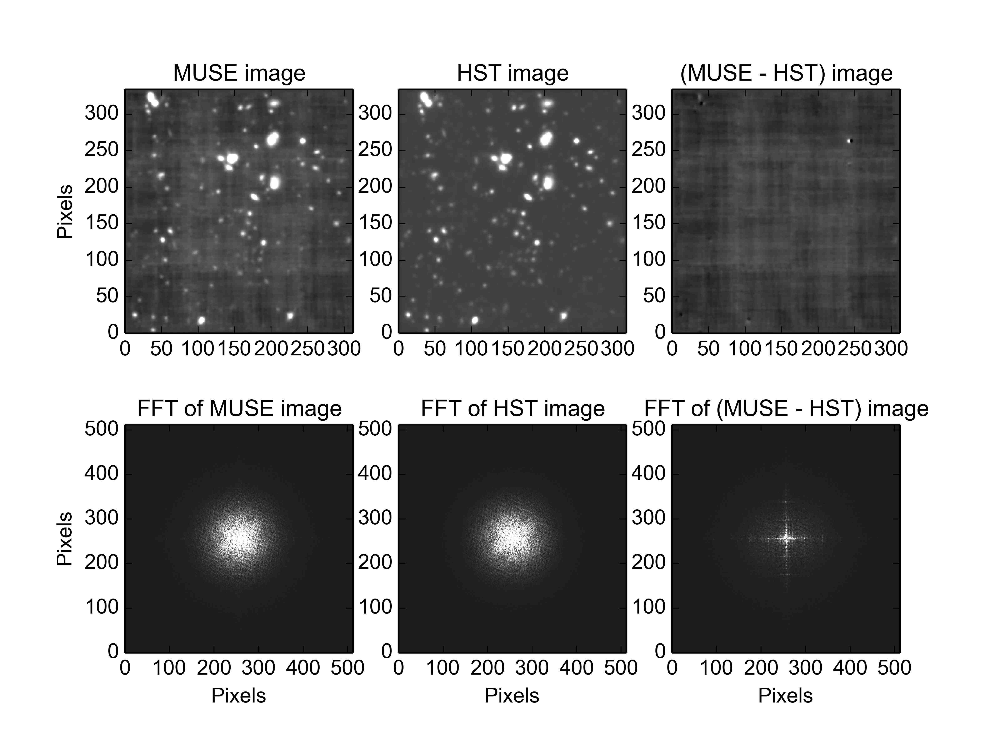
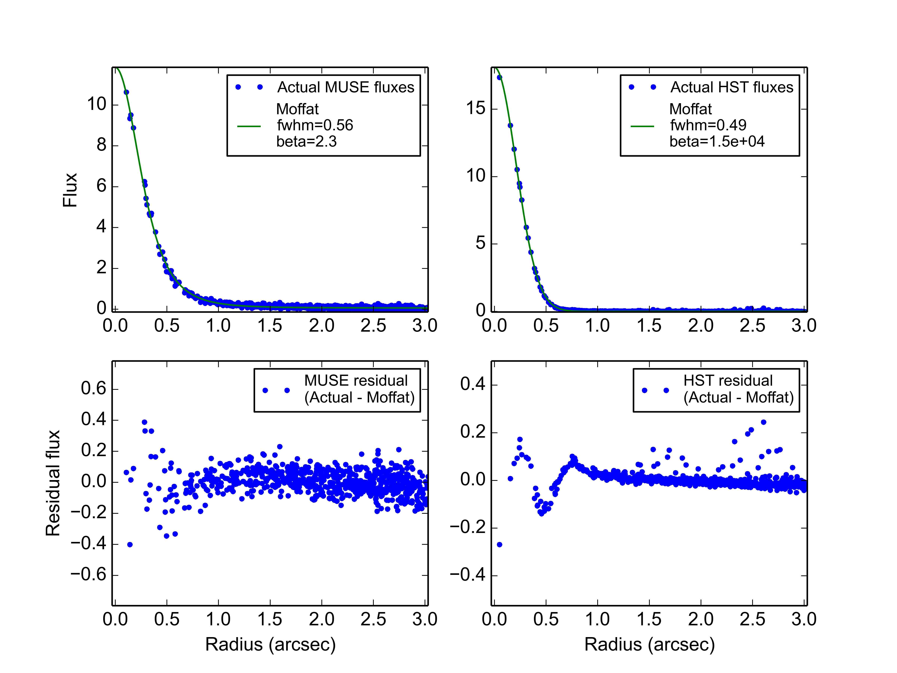

.. _tutorial:

A tutorial on photometric parameter fitting
===========================================

The following tutorial will describe the steps needed to fit the
photometric parameters of a MUSE cube. The following steps will be
elaborated.

1: :ref:`tutorial_step1`

   First an HST image is downloaded that incorporates the majority of
   the area covered by the MUSE observation, and that has a spectral
   response curve that lies mostly within the wavelength coverage of
   the MUSE cube.

2: :ref:`tutorial_step2`

   Next an image is extracted from the MUSE cube that has the same
   spectral response curve as the HST image.

3: :ref:`tutorial_step3`

   Next the HST image is resampled onto the pixel grid of the MUSE
   image obtained in :ref:`step 1<tutorial_step1>`, and its fluxes are
   rescaled to have the same units as the MUSE image.

4: :ref:`tutorial_step4`

   The photometric parameters of the MUSE image are first fitted
   using the default *global image* fitting algorithm.

5: :ref:`tutorial_step5`

   In step 4, the plotted residuals of the fit show that one star in
   the image does not fit very well, so in this step, to improve the
   fit, the fitting script is run again, but this time a circular
   region of pixels around the star are excluded from the fit.

6: :ref:`tutorial_step6`

   As an alternative method of handling the effect of a bright star,
   this step performs the fit on a small area of the image that
   includes the star, and also performs star profile fits, to obtain
   independent estimates of the photometric parameters.

.. _tutorial_step1:

Downloading a suitable HST observation
--------------------------------------

A prerequisite of the fitting procedure is that there be an HST WFC
ACS observation of the same region as the MUSE cube, taken through an
HST imaging filter that significantly overlaps with the MUSE
wavelength coverage. The chosen HST image should be as published by
STSCI. Specifically it should still be calibrated in electron/s, and
its pixel size should be on the order of 0.03 to 0.06 arcsec,
depending on which version of the ACS was used, and whether or not the
image drizzling was used.

This tutorial will fit for the photometric parameters of an
observation of the MUSE UDF04 field. This field is a subset of the HST
Ultra Deep Field, and corresponding HST observations of this field are
available at the following web page:

  https://archive.stsci.edu/missions/hlsp/xdf/

The above page lists images taken through a number of different
imaging filters.  From section, :ref:`hst_filter_curves`, we know that
the filters, F606W, F775W, F814W and F850LP, significantly overlap
with the MUSE coverage.

The web-page also provides equivalent images that have 30mas pixels
and 60mas pixels. It is always best to choose the highest resolution
image that is available. The reason is that when an image is resampled
to a lower resolution, a decimation filter is applied to avoid
aliasing, and this changes the size and profile of the PSF. The
photometry fitting program is very sensitive to the PSF profile of the
HST image, so this can degrade the results. Note that the fitting
program has been optimized for HST images with 30mas pixel sizes, so
this is the best resolution to obtain if possible.

For the tutorial, the following image is downloaded, which has 30mas
pixels, and was taken through the F775W filter:

  hlsp_xdf_hst_acswfc-30mas_hudf_f775w_v1_sci.fits

.. _tutorial_step2:

Extracting a suitable image from the MUSE cube
----------------------------------------------

The fitting procedure needs a MUSE image that has the same spectral
response curve as the chosen HST image. In this demo, the spectral
response of the HST image is that of the F775W filter of the HST Wide
Field Camera. The following example, which is run from a normal shell
prompt, uses the :ref:`make_wideband_image<make_wideband_image>`
script to extract an image of this response curve from a MUSE cube
called ``udf04_cube.fits``::

  % make_wideband_image wfc_F775W.dat udf04_cube.fits 
  Reading filter: wfc_F775W.dat
  Reading cube: udf04_cube.fits
  Computing the output image.
  Writing image to: wfc_F775W_udf04_image.fits
  %

On a single 2.4GHz CPU this took one minute to run. Beware that this
script requires a lot of memory. This is because MUSE cubes are large,
and MPDAF reads the whole cube into memory. For example, the above
process showed peak memory usage of 22GB of memory.

.. _tutorial_step3:

Resample and rescale the HST image
----------------------------------

The fitting procedure also requires that the reference HST image be
resampled onto the same pixel coordinate grid as the MUSE image. In
the following example, the
:ref:`regrid_hst_to_muse<regrid_hst_to_muse>` script is used to
resample the HST image that was downloaded in :ref:`step
1<tutorial_step1>`. The MUSE image that was extracted in :ref:`step
2<tutorial_step2>` is also used to indicate the desired pixel grid.
In addition to resampling the the HST image, this script also changes
its units from electron/s to the flux units of the MUSE image::

  % regrid_hst_to_muse --field UDF04 wfc_F775W_udf04_image.fits hlsp_xdf_hst_acswfc-30mas_hudf_f775w_v1_sci.fits
  Reading MUSE image: wfc_F775W_udf04_image.fits
  Reading HST image: hlsp_xdf_hst_acswfc-30mas_hudf_f775w_v1_sci.fits
  WARNING: MpdafUnitsWarning: Error parsing the BUNIT: 'ELECTRONS/S' did not parse as unit: At col 0, ELECTRONS is not a valid unit. Did you mean electron? [mpdaf.obj.data]
  Resampling the HST image onto the MUSE pixel grid.
  Changing the flux units of the HST image to match the MUSE image
  Writing the output file: hst_F775W_for_UDF04.fits
  %

Note that the warning message about electrons/s units can safely be
ignored. This comes from the astropy.units module when it reads the
FITS header of the HST image. The script knows what the actual units
are in HST images, so it ignores the claimed units, and rescales the
fluxes from HST electron/s units to physical units without consulting
the incorrectly parsed units from the header.

For reference, this process took 30 seconds on a single 2.4GHz CPU,
and had a peak memory usage of 1.7GB.

.. _tutorial_step4:

Perform a global image fit for the photometric parameters
---------------------------------------------------------

At this point, we now have a pair of HST and MUSE images that can be
used to fit for the photometric parameters of the MUSE image. We start
by performing a fit using default parameters of the
:ref:`fit_photometry<fit_photometry>` script. We also use the
:ref:`--display<plotting_options>` option to request that a plot of
the fit be shown::

  % fit_photometry hst_F775W_for_UDF04.fits wfc_F775W_udf04_image.fits --display
  # MUSE observation ID              Method    Flux    FWHM    beta      Flux  x-offset  y-offset
  #                                           scale     (")            offset       (")       (")
  #--------------------------------- ------  ------  ------  ------  --------  --------  --------
               wfc_F775W_udf04_image  image  0.9819  0.5697  2.5000   0.04191  -0.00188  -0.01732
  %

With the default arguments, this reports a summary of the fitting
photometric parameters. The addition of the `--verbose` option could
alternatively be used to list many more details of the fit, including
uncertainties, reduced chi-squared etc.

The reported beta value is precisely 2.5 because by default this
parameter is fixed in the fit to that value. This is done because
there is some degeneracy between this parameter and other parameters
in the fit, and it is easier to obtain a smooth trend in the fitted
FWHM value versus wavelength if the beta value is constrained to the
same value in all fits. The restriction can be removed by adding the
option `--fix_beta=none`.

The following plot was generated by the above example. The plot was
saved to a JPEG file by running the example again, this time with the
:ref:`--hardcopy<plotting_options>` option.

The image shown in the top-left corner of the plot is the input MUSE
image, after it has been given a mask that matches that of the HST
image, and after it has been convolved with the antialiasing filter
that was used when resampling the HST image in :ref:`step
1<tutorial_step1>`. Under the MUSE image is its Fourier transform,
which is where the fitting procedure operates.

The middle of the top-most plots is the best-fit simulation of the
MUSE image based on the HST image. This is the HST image after it has
been convolved with the best-fit MUSE PSF, scaled and offset by the
best-fit calibration factors, and shifted in position by the best-fit
x and y position offsets. Ideally it would be identical to the MUSE
image.

The image plotted in the top-right corner of the plot, is the
difference between the two images to the left of it. In other words,
this is an image of the residuals of the photometric fit. Ideally it
would be an image of the background noise and instrumental
defects. Indeed, most of the residual image appears to be an image of
the systematic stripes that are seen in the background of the original
MUSE image. However there is also a bright spot near the top-left
corner of the residual image, which turns out to be the residuals of a
bright star. This is a common occurrence for the following reasons.

The global image fitting algorithm works by assuming that the only
difference between two observations of the same patch of sky, are
differences caused by seeing, pointing errors and calibration
errors. However if the HST and MUSE observations are performed at
different times, then this assumption can be broken by any variable
sources in the field, and more importantly by stars with significant
proper motion. This is the explanation of the residuals in the above
image. Looking closely at the residual plot, one can see that the
residuals are bright on the left and dark on the right, implying that
the star moved leftwards, in this case by about a 0.2 arcsecond pixel.

.. _tutorial_step5:

Ignoring a problematic star while fitting
-----------------------------------------

In the previous step, the global image fit revealed a star that didn't
fit very well, because it had moved slightly between the HST and MUSE
observations.  In this case the problematic star didn't seem to bias
the fit significantly, because all of the other sources were well
subtracted. However when a field contains one or more bright stars
that move by even a fraction of a pixel between the HST and MUSE
observations, the global fit can be badly affected. There are a couple
of ways to handle this, as described in this and the next steps of the
tutorial.

One way to handle the problem of a bright star with high proper
motion, is to mask a small area of the image where the star is, so
that it doesn't contribute to the fit. This can work well in fields
that contain lots of sources after the problematic ones have been
removed. The way to do this is to use the :ref:`--regions<regions>`
option with a ds9 region file that defines a small region to be
excluded around the star. We will use the region file,
:download:`UDF04.reg<../_static/imphot/UDF04.reg>`, which contains the following
lines::

  # DS9 region file for PSF fitting to MUSE field UDF04.
  fk5
  # Exclude a problematic point source from the PSF fit.
  -circle(53.148540, -27.770139, 2.0")

The minus sign that precedes the circular region definition, indicates
that this region is to be excluded from the fit. The region file was
created by running ds9 on the MUSE image and using the mouse to define
a 2.0 arcsecond circular region, centered on the star. The region file
is passed to the :ref:`fit_photometry<fit_photometry>` script as
follows::

  % fit_photometry hst_F775W_for_UDF04.fits wfc_F775W_udf04_image.fits --regions UDF04.reg --display
  # MUSE observation ID              Method    Flux    FWHM    beta      Flux  x-offset  y-offset
  #                                           scale     (")            offset       (")       (")
  #--------------------------------- ------  ------  ------  ------  --------  --------  --------
               wfc_F775W_udf04_image  image  0.9768  0.5730  2.5000   0.04169   0.01401  -0.01656
  %

The results are very similar to those of the previous step, which
indicates that, in this case, the star didn't bias the previous fit
significantly. The plot this example generated, is the following:

In this image the problematic star no longer appears in either the
MUSE image or the HST image, because the region-file caused a circular
area there to be masked. As such it is no surprise that it is no
longer visible in the residual image. Otherwise, the residual image
looks about the same as before.

.. _tutorial_step6:

Performing a fit to a bright star
---------------------------------

Another way to handle the problem of a bright star with high proper
motion, is to restrict the fitted part of the image to a small region
that encloses the star. This is often the best option, because the
profile of a bright star should be able to provide a good fit for the
photometric parameters.

In the previous step the :ref:`--regions<regions>` option was used to
mask the area where the star was, to prevent it from biasing the
fit. The :ref:`--regions<regions>` option could alternatively be used
to mask everywhere *except* where the star is, by using a region file
that didn't have a minus sign before the circular region
definition. However a better, and more convenient approach is to use
the :ref:`--star<star_fitting>` option. This takes the star position
and the radius of the region around it to include in the fit, and
since this is given on the command-line, there is no need for a region
file::

  % fit_photometry hst_F775W_for_UDF04.fits wfc_F775W_udf04_image.fits --star 53.148540 -27.770139 3.0 --display
  # MUSE observation ID              Method    Flux    FWHM    beta      Flux  x-offset  y-offset
  #                                           scale     (")            offset       (")       (")
  #--------------------------------- ------  ------  ------  ------  --------  --------  --------
               wfc_F775W_udf04_image  image  1.1581  0.5711  2.5000   0.08863  -0.13003  -0.02434
               wfc_F775W_udf04_image  stars  1.2289  0.5658  2.5000   0.06651  -0.13615  -0.02581
  %

Note that this generated two lines of fitted photometric
parameters. On the first line the *Method* column says *image*, which
indicates that the parameters were fitted by the global image fitting
algorithm. On the second line the *Method* column says *stars*, which
indicates that the parameters there were fitted by fitting Moffat PSF
profiles to the same star in the HST and the MUSE images, and
comparing the results. In principle, if the star is bright and it
really is a point source in both images, then the results of the two
techniques should be the same. In this case the results are very
similar, apart from a 6% difference in the fitted scale factors.

In both sets of fitted parameters, the scale factor is about 20%
higher than in the previous fits that operated on the whole
image. This turns out to be a typical feature of star fits. It implies
is that either the fluxes of the star in the HST image are lower than
expected, or that the fluxes of stars in MUSE images are larger than
expected. This does not appear to be a saturation phenomenon, because
it doesn't appear to worsen with increasing stellar flux.

So far this algorithm has only been tested on fields in the HST UDF,
and the HST UDF images are the accumulation of a decade of individual
observations, so one possible explanation for the high scale factor
for star fits, is that either proper-motion or parallax-induced motion
of nearby stars in the UDF, has smeared the flux of the stars in the
HST images, widening their profiles in one direction and reducing
their apparent peak fluxes. There is indeed evidence for such widening
along one direction when the 2D residuals of the fits to bright stars
are examined closely.  If this positional explanation is correct, then
the increase in the scale factor on a given star should be the same at
all wavelengths, and affect all MUSE images equally, so useful
comparisons of the scale factor can still be made between different
MUSE exposures of a field.

The above example generated two plot files. The first showed the
result of the image fitting algorithm, showing just the small area of
the image that the fit was performed on:

.. image:: ../_static/imphot/tutorial_image3.jpg

The second plot file shows the Moffat profile fit to the star in the
MUSE image, followed by the  Moffat profile fit to the star in the
HST image.

