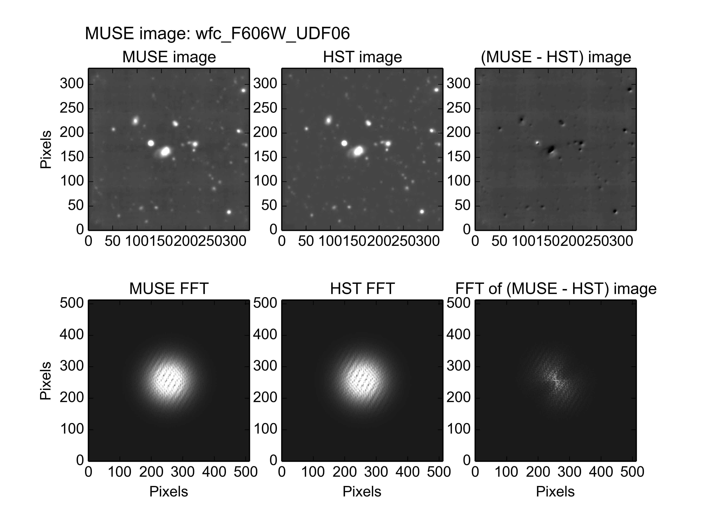
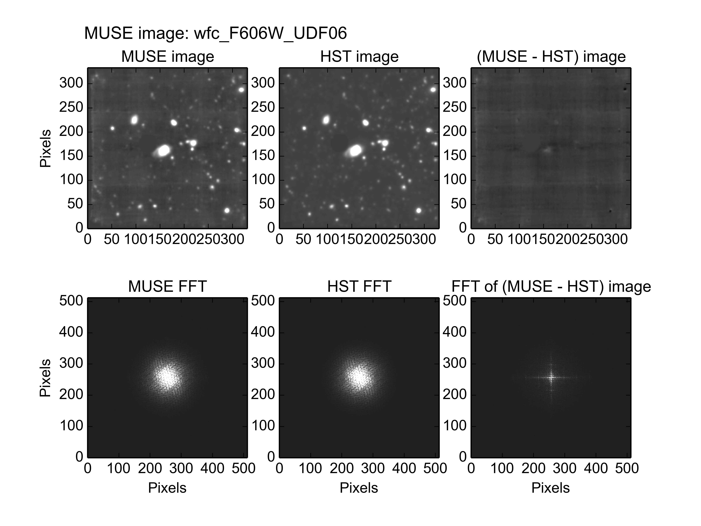
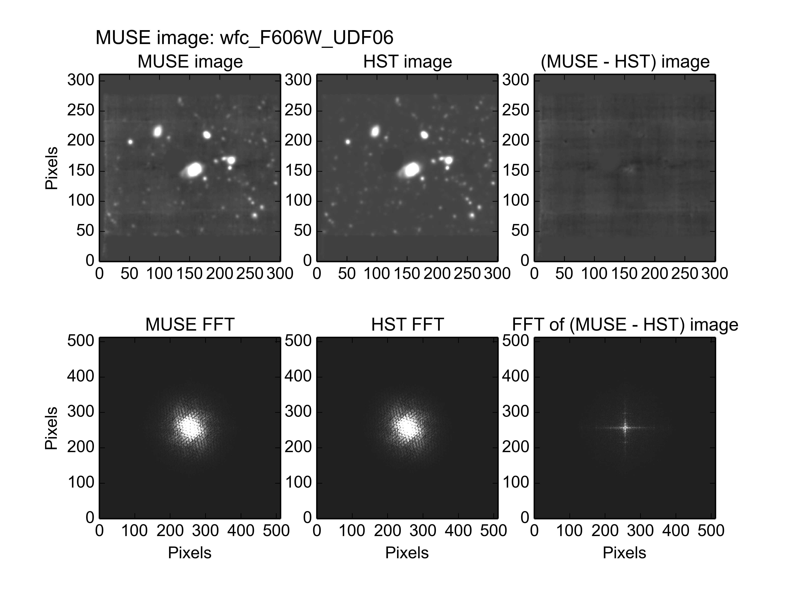
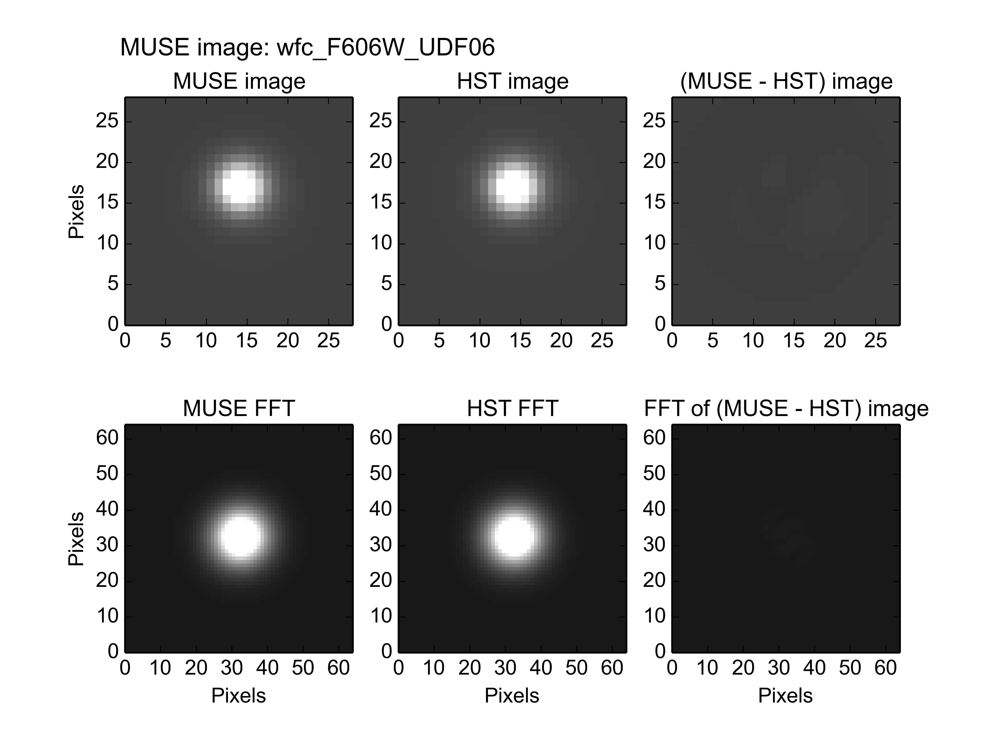
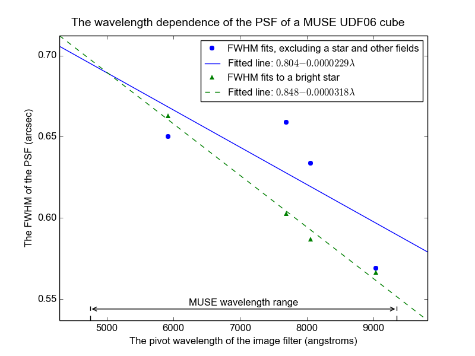

.. _UDF06:

The photometry of MUSE field UDF06
==================================

Muse field UDF06 is a 1x1 arc-minute field centered at Right Ascension
03:32:42, and declination -27:47:55, within the Hubble UDF. The HST
image of this region, seen through the F606W filter and resampled onto
the pixel grid of the MUSE images of UDF06, is shown below.

.. image:: ../_static/imphot/hst_udf06.jpeg

This field contains a bright star which should be excluded from the
fit to obtain a good fit for all other sources between the MUSE and
HST images, as described in the :ref:`pitfalls<pitfalls>` section. The
output of the following command, including the plot shown below it,
show the poor fit that is obtained if the star is not excluded from
the fit::

  % fit_photometry hst_F606W_for_UDF06.fits UDF06/wfc_F606W_UDF06.fits --fix_beta=2.8 --hardcopy jpeg
  # MUSE observation ID              Method    Flux    FWHM    beta      Flux  x-offset  y-offset
  #                                           scale     (")            offset       (")       (")
  #--------------------------------- ------  ------  ------  ------  --------  --------  --------
                     wfc_F606W_UDF06  image  1.0230  0.6410  2.8000   0.05630  -0.16250   0.21167

A very poor fit was obtained on this image, as seen by the strong
hints of the original sources in the residual image. The reason for
the poor fit is that the bright star is much brighter than anything
else in the original images, and this star moved significantly between
the HST and MUSE observations. To minimize the residuals, which were
dominated by the star, the least-squares fit shifted the images to
align the star, and this misaligned the rest of the sources in the
image. Evidence of this misalignment can be seen in the asymmetric
nature of the residuals of all of the sources except the star.

If the star is excluded from the fit, as recommended in the
:ref:`pitfalls<pitfalls>` section, by passing
:download:`exclude_udf_stars.reg<../_static/imphot/exclude_udf_stars.reg>`
region file to the :ref:`fit_photometry<fit_photometry>` script, then
the results are as follows::

  % fit_photometry ~/muse/images/UDF06/hst_F606W_for_UDF06.fits ~/muse/images/UDF06/wfc_F606W_UDF06.fits --regions=regions/exclude_udf_stars.reg --fix_beta=2.8 --hardcopy jpeg
  # MUSE observation ID              Method    Flux    FWHM    beta      Flux  x-offset  y-offset
  #                                           scale     (")            offset       (")       (")
  #--------------------------------- ------  ------  ------  ------  --------  --------  --------
                     wfc_F606W_UDF06  image  0.9340  0.6681  2.8000   0.06155  -0.00153   0.00035

Excluding the star resulted in a much better fit, in which the much
smaller range of values in the residual image now allows one to see
the instrumental background of the MUSE image. However there are still
a couple of small, obviously over-subtracted sources near the right
edge of the residual image. This is because the UDF06 image was
actually extracted from a cube that contained a mosaic of all of the
MUSE UDF fields, and the UDF02, UDF03, UDF05, UDF08 and UDF09 fields
overlap the upper, right and lower edges of UDF06. To resolve this the
following region file was created that excludes not only the bright
star, but also the rectangular regions of the overlapping fields. The
contents of the region file look as follows::

  fk5
  -box(3:32:41.610,-27:46:30.78,67.2",67.4",41.9952)    # Exclude UDF02
  -box(3:32:44.733,-27:47:11.58,66.6",66.2",41.9891)    # Exclude UDF03
  -box(3:32:38.559,-27:47:13.45,67.2",67",42.0011)      # Exclude UDF05
  box(3:32:41.897,-27:47:55.48,67",67",41.9946)         # Include UDF06
  -box(3:32:35.462,-27:47:58.25,66.6",66.6",42.0071)    # Exclude UDF08
  -box(3:32:38.827,-27:48:35.64,67",66.8",42.0006)      # Exclude UDF09
  -circle(53.176896, -27.799861, 3.0")                  # Exclude star

When this is passed to the ``--regions`` argument, the fit changes as follows::

  % fit_photometry hst_F606W_for_UDF06.fits wfc_F606W_UDF06.fits --regions=udf06_extract.reg --fix_beta=2.8 --hardcopy jpeg
  # MUSE observation ID              Method    Flux    FWHM    beta      Flux  x-offset  y-offset
  #                                           scale     (")            offset       (")       (")
  #--------------------------------- ------  ------  ------  ------  --------  --------  --------
                     wfc_F606W_UDF06  image  0.9398  0.6503  2.8000   0.05477  -0.00385   0.00282

This appears to be a slightly better fit for the sources within the
extracted part of UDF06. There is still something left of the large
bright source near the center of the image, but this is probably due
to the clear trough in the instrumental background, left over from the
original MUSE image. This is probably a less sensitive part of the
image, with a slightly different flux scale than the rest of the
image.

Another estimate of the PSF can be obtained by restricting the fitted
area of the image to a small region around the star, as follows::

  % fit_photometry hst_F606W_for_UDF06.fits wfc_F606W_UDF06.fits --regions=udf06_star.reg --fix_beta=2.8 --hardcopy jpeg
  # MUSE observation ID              Method    Flux    FWHM    beta      Flux  x-offset  y-offset
  #                                           scale     (")            offset       (")       (")
  #--------------------------------- ------  ------  ------  ------  --------  --------  --------
                     wfc_F606W_UDF06  image  1.1027  0.6629  2.8000   0.04426  -0.17819   0.23157

The FWHM of the PSF fitted to the star similar to the value fitted to
the image without the star. The flux scale-factor is about 17% higher,
but that is expected, for the reasons described in the
:ref:`pitfalls<pitfalls>` section. The fitted pointing error is very
different, as expected for a star that has moved. The vector
difference between the pointing errors fitted to the star and the
image, is 0.29 arcsec. Given that about 11 years elapsed between the
HST and MUSE observations of the UDF, this corresponds to a proper
motion of about 26.5 mas/year. This is similar to the value of
25.16±0.45 that Pirkal et al (2005) reported for this star (UDF 2150)
in [#f1]_.

FWHM versus wavelength
----------------------

The examples of the previous section operated on images that had the
spectral response curve of the HST F606W filter. If similar fits are
also performed to MUSE UDF06 images that have the spectral response
curves of other HST filters, then the variation of the fitted FWHM of
the PSF can be obtained versus wavelength. In the following diagram,
the best-fit values of the PSF FWHM are plotted versus the pivot
wavelength of these filters. The results of 2 different sets of fits
are plotted. The first fit was to everything in the UDF06 images
except for the bright star, which was excluded with a region file. The
second fit was limited to a region of 3 arcseconds radius, centered on
the star.

It is not clear why the results for the F775W and F814W filters are so
discrepant between the fits to the image without the star, and the
fits to the stellar images. If a new fit is performed to the image
with the star removed, but this time with the FWHM fixed to the value
fitted to the star, then the resulting residuals are not as good, so
it appears that the average FWHM values in the F775W and F814W images
really don't behave as expected. One clue to the reason is that the
source residuals show some evidence of a position mismatch, but this
shift seems to have a different sign on the left and right sides of
the image. This suggests a problem in the position registration of the
stacked exposures that contributed to the originating MUSE
mosaic. Hopefully when individual cubes are available for each field,
this will be resolved.

.. rubric:: Footnotes

.. [#f1] *Stars in the Hubble Ultra Deep Field*, Pirzkal, N.;
         Sahu, K. C.; Burgasser, A.; Moustakas, L. A.; Xu, C.;
         Malhotra, S.; Rhoads, J. E.; Koekemoer, A. M.; Nelan, E. P.;
         Windhorst, R. A.; Panagia, N.; Gronwall, C.; Pasquali, A.;
         Walsh, J. R., Ap. J. (2005) 622, 319
