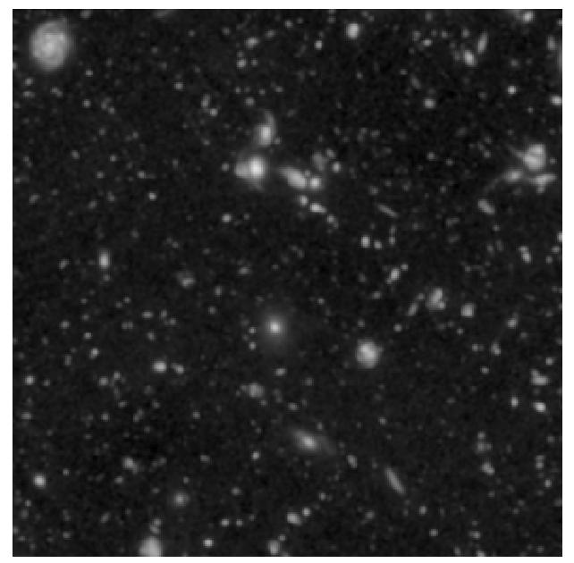
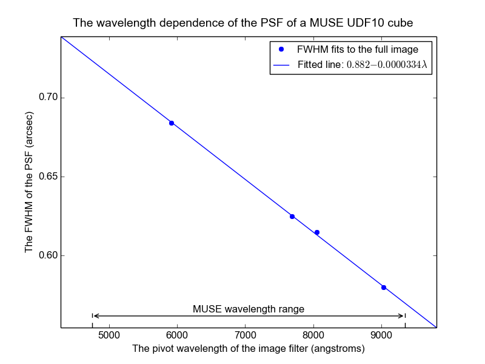

.. _UDF10:

The photometry of MUSE field UDF10
==================================

Muse field UDF10 is a 1x1 arc-minute field centered at Right Ascension
03:32:39, and declination -27:46:44, within the Hubble UDF. The HST
image of this region, seen through the F606W filter and resampled onto
the pixel grid of the MUSE images of UDF10, is shown below.

This field contains no stars or other bright point sources, so its
photometric parameters can only be fit using the global image fitting
method. When a fit is performed using the F606W HST image, the results
are as follows::

  % fit_photometry hst_F606W_for_UDF10.fits wfc_F606W_UDF10.fits --fix_beta=2.8 --hardcopy=jpeg
  # MUSE observation ID              Method    Flux    FWHM    beta      Flux  x-offset  y-offset
  #                                           scale     (")            offset       (")       (")
  #--------------------------------- ------  ------  ------  ------  --------  --------  --------
                     wfc_F606W_UDF10  image  1.0015  0.6840  2.8000   0.03428  -0.00664  -0.01456

This recorded the following plot of the fitted images and their residuals:

.. image:: ../_static/imphot/udf10_image_fit.jpeg

The residual image is virtually empty, implying that a good fit was
achieved.

FWHM versus wavelength
----------------------

When the above fit was performed on images with the response curves of
the HST F606W, F775W, F814P, and F850LP filters, the fitted FWHMs of
the PSF had the values shown in the following plot.

The fitted FWHM values closely follow a straight line versus
wavelength. The plotted line is the best fit line through them.
