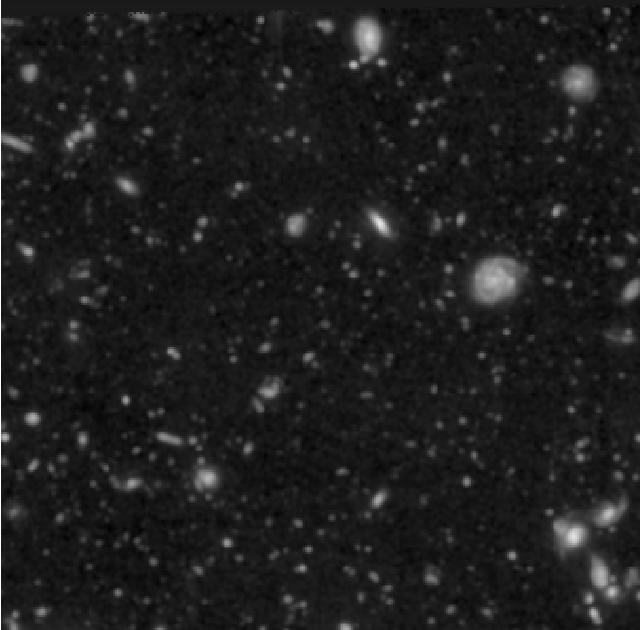
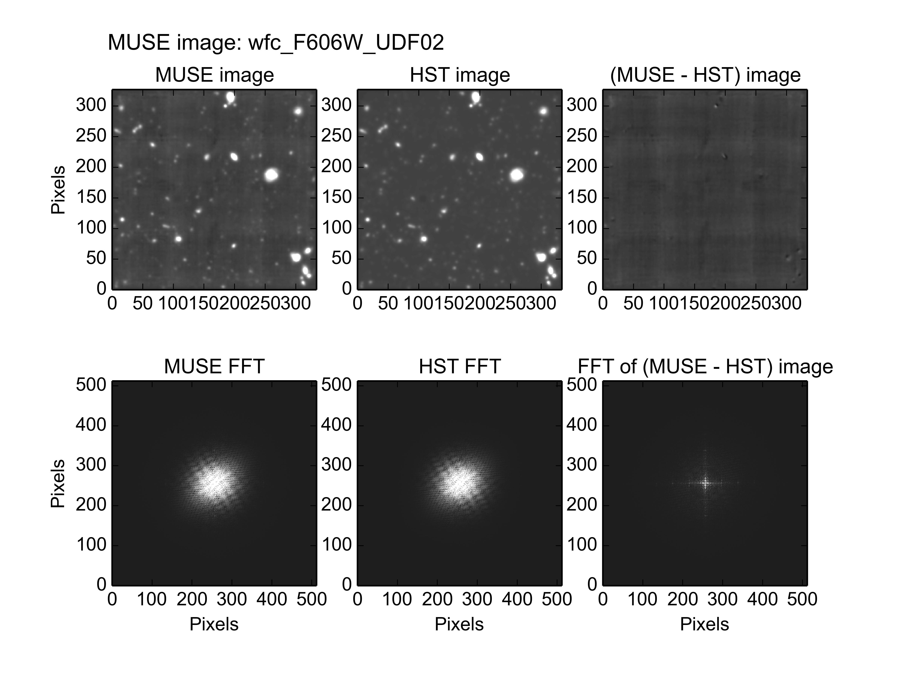
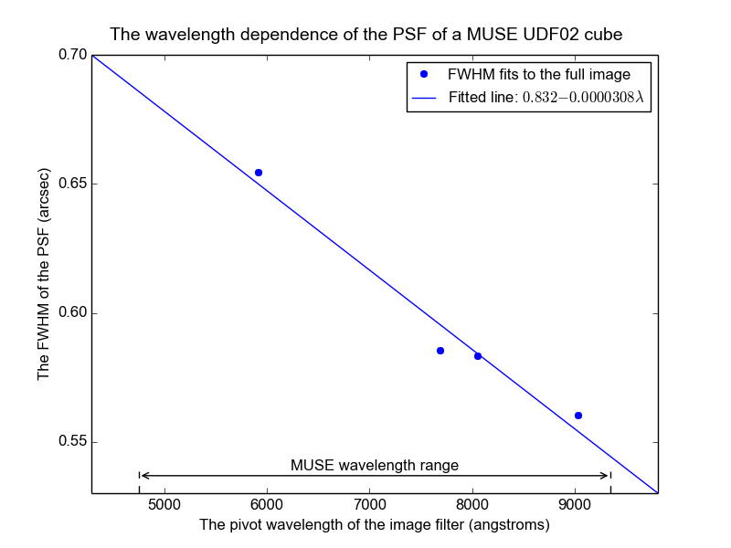

.. _UDF02:

The photometry of MUSE field UDF02
==================================

Muse field UDF02 is a 1x1 arc-minute field centered at Right Ascension
03:32:42, and declination -27:46:31, within the Hubble UDF. The HST
image of this region, seen through the F606W filter and resampled onto
the pixel grid of the MUSE images of UDF02, is shown below.

This field contains no stars or other bright point sources, so its
photometric parameters can only be fit using the global image fitting
method. When a fit is performed using the F606W HST image, the results
are as follows::

  % fit_photometry hst_F606W_for_UDF02.fits wfc_F606W_UDF02.fits --fix_beta=2.8 --hardcopy=jpeg
  # MUSE observation ID              Method    Flux    FWHM    beta      Flux  x-offset  y-offset
  #                                           scale     (")            offset       (")       (")
  #--------------------------------- ------  ------  ------  ------  --------  --------  --------
                     wfc_F606W_UDF02  image  0.9582  0.6544  2.8000   0.06157  -0.00301   0.00239

This recorded the following plot of the fitted images and their residuals:

The residual image is dominated by the uneven instrumental background
of the original MUSE image, which implies that a good fit was
achieved. Note that the obvious residuals of sources in the bottom
left corner of the image are where the image contains overlapping
contributions from the UDF01, UDF04 and UDF05. These contributions are
there because the MUSE image was extracted from a mosaic of all of the
MUSE fields. The part of the image with overlapping contributions
could be excluded with a region file, but this wasn't done, because
about 50% of the image suffers from this problem, mostly due to the
contribution of UDF10, and the fit wouldn't be well constrained by
what was left. A better fit is likely to be obtained once individual
cubes of stacked observations are available for each MUSE UDF field.

FWHM versus wavelength
----------------------

When the above fit was performed on images with the response curves of
the HST F606W, F775W, F814P, and F850LP filters, the fitted FWHMs of
the PSF had the values shown in the following plot.

The FWHMs roughly follow a straight line. The plotted line is the best
fit line through them.
