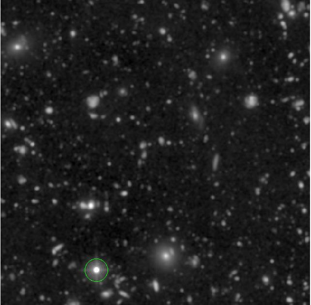
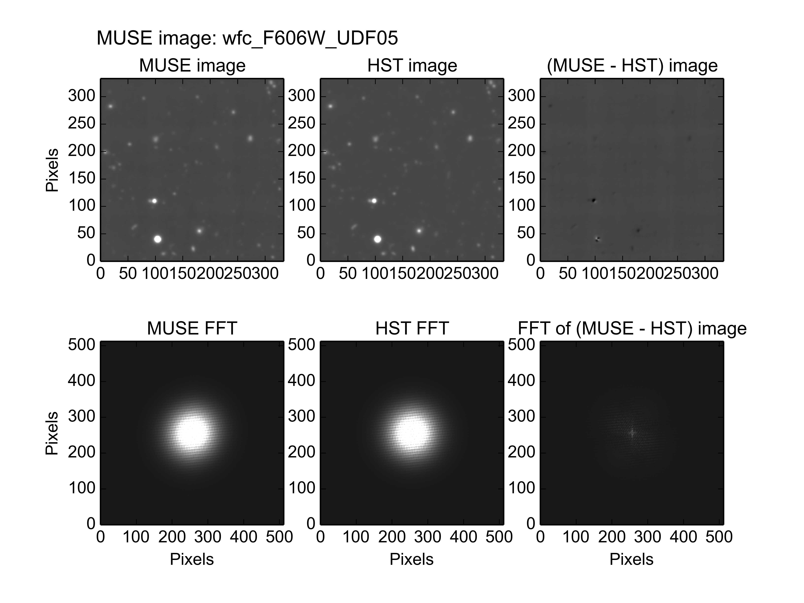
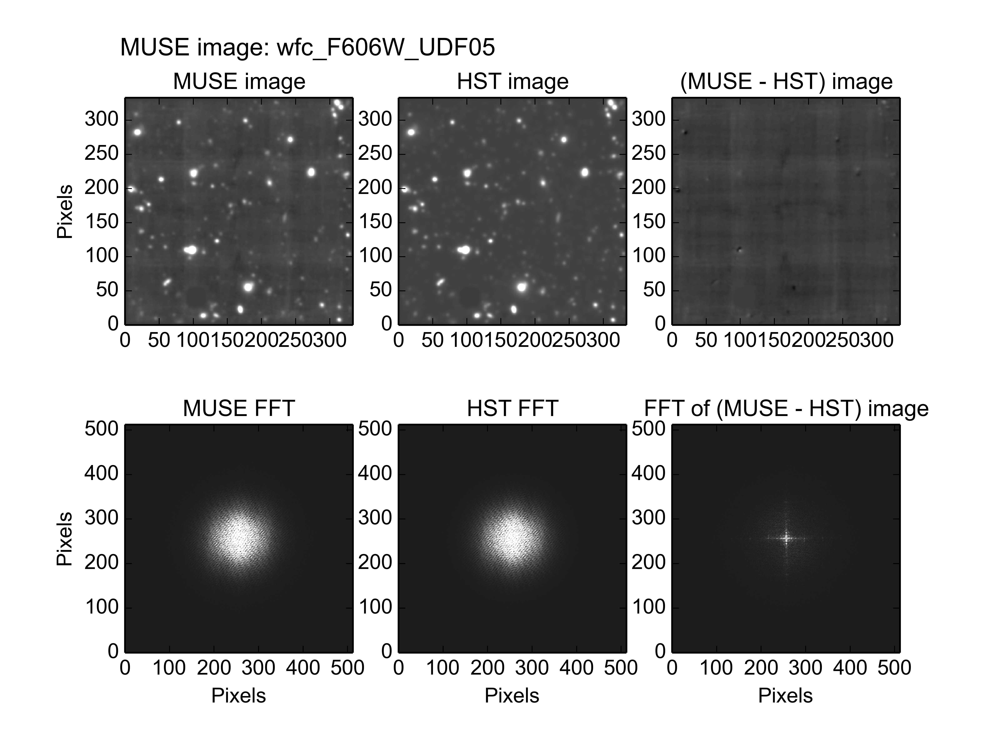
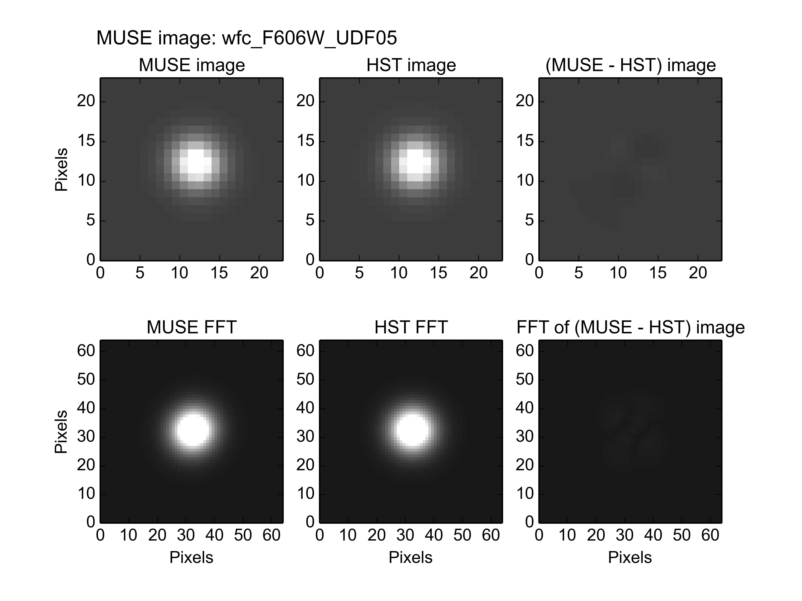
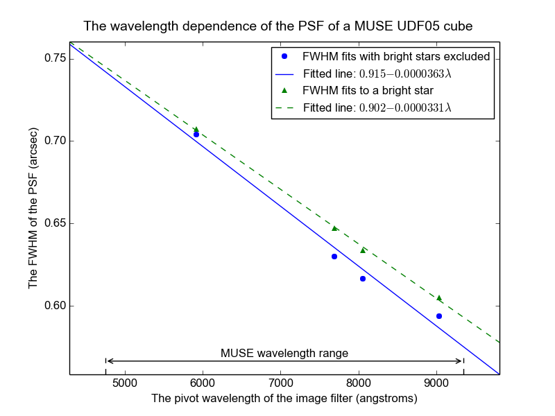

.. _UDF05:

The photometry of MUSE field UDF05
==================================

Muse field UDF05 is a 1x1 arc-minute field centered at Right Ascension
03:32:39, and declination -27:47:14, within the Hubble UDF. The HST
image of this region, seen through the F606W filter and resampled onto
the pixel grid of the MUSE images of UDF05, is shown below.

This field contains a bright star which should be excluded from the
fit to obtain a good fit for all other sources between the MUSE and
HST images, as described in the :ref:`pitfalls<pitfalls>` section. The
output of the following command, including the plot shown below it,
show the poor fit that is obtained if the star is not excluded from
the fit::

  % fit_photometry hst_F606W_for_UDF05.fits wfc_F606W_UDF05.fits --fix_beta=2.8 --hardcopy jpeg# MUSE observation ID              Method    Flux    FWHM    beta      Flux  x-offset  y-offset
  #                                           scale     (")            offset       (")       (")
  #--------------------------------- ------  ------  ------  ------  --------  --------  --------
                     wfc_F606W_UDF05  image  1.0572  0.7027  2.8000   0.04707  -0.00697   0.00151

The contents of the residual image indicate that this is a poor
fit. If one looks closely at the residuals of sources other than the
star, they all have a slightly dark half and a light half, as though
the HST and MUSE images were shifted slightly relative to each
other. This is because the star itself moved between the HST and the
MUSE observations. The fitted pointing error is dominated by the shift
of the star, because the star is the brightest object in the image.

If the star is excluded from the fit, as recommended in the
:ref:`pitfalls<pitfalls>` section, by passing
:download:`exclude_udf_stars.reg<_static/imphot/exclude_udf_stars.reg>`
region file to the :ref:`fit_photometry<fit_photometry>` script, then
the results are as follows::

  % fit_photometry ~/muse/images/UDF05/hst_F606W_for_UDF05.fits ~/muse/images/UDF05/wfc_F606W_UDF05.fits --regions=regions/exclude_udf_stars.reg --fix_beta=2.8 --hardcopy jpeg
  # MUSE observation ID              Method    Flux    FWHM    beta      Flux  x-offset  y-offset
  #                                           scale     (")            offset       (")       (")
  #--------------------------------- ------  ------  ------  ------  --------  --------  --------
                     wfc_F606W_UDF05  image  0.9402  0.7038  2.8000   0.05419   0.04955  -0.05088

The residual image is now dominated by the instrumental background of
the MUSE image, but there are still clear residuals from other
sources. Oddly, most of the residual sources exhibit a dark half and a
light half, as though the MUSE and the HST images were shifted with
respect to each other. Even more odd, is the fact that the remainder
of the bright source in the lower left half of the image appears to
have been shifted in a different direction to the sources in the upper
right half of the image. Fortunately the provenance of the MUSE image
provides a reasonable explanation for this, as described below.

The MUSE UDF05 image that was used in the above examples, was actually
extracted from a cube that contained a mosaic combination of all of
the MUSE UDF fields.  At the time of writing, there was no cube of the
combined UDF05 exposures. Only two cubes were avaiable; a mosaic of
all of the fields, and a cube of the UDF10 field.  So to obtain high
SNR photometric fits for the UDF05 field, the only practical option
was to extract an image of the UDF05 field from the mosaic
cube. Unfortunately in the mosaic, the UDF10 field overlaps the top
right half of the UDF05 image, and its greater integration time means
that it dominates that part of the image. As a result, it is not
surprising that a single pointing-error solution does not fit the
whole image. Indeed, the other fitted parameters are likely affected
by this too.

In this case, a fit that is restricted to a small area centered on the
star is likely to provide a more reliable estimate of the
PSF. Unfortunately the flux scale-factor will be affected by the
faint-star effect, described in the :ref:`pitfalls<pitfalls>` section,
and the fitted pointing-error will be affected by the proper motion of
the star. When the fit is performed to the star, the results are as
follows::

  % fit_photometry hst_F606W_for_UDF05.fits wfc_F606W_UDF05.fits --regions=udf05_star.reg --fix_beta=2.8 --hardcopy jpeg
  # MUSE observation ID              Method    Flux    FWHM    beta      Flux  x-offset  y-offset
  #                                           scale     (")            offset       (")       (")
  #--------------------------------- ------  ------  ------  ------  --------  --------  --------
                     wfc_F606W_UDF05  image  1.0875  0.7072  2.8000  -1.54256  -0.00722   0.00376

The vector difference between the X,Y pointing errors of the image-fit
with the star excluded, and the fit with to the stellar image, gives
an apparent shift of about 0.08 arcsec. Spread over the 11 years that
elapsed between the HST observation of the UDF and the MUSE
observations, this implies that the star has a proper motion of about
7 mas/year. Given the uncertainty of the image-fit with the stars
excluded, it isn't clear how much confidence to place in this result,
but it is not too far from the value of 8.84±0.66 mas/year that Pirkal
et al (2005) reported for this star (UDF 3166) in [#f1]_.

FWHM versus wavelength
----------------------

The examples of the previous section operated on images that had the
spectral response curve of the HST F606W filter. If similar fits are
also performed to MUSE UDF05 images that have the spectral response
curves of other HST filters, then the variation of the fitted FWHM of
the PSF can be obtained versus wavelength. In the following diagram,
the best-fit values of the PSF FWHM are plotted versus the pivot
wavelength of these filters. The results of 2 different sets of fits
are plotted. The first fit was to everything in the UDF05 images
except for the bright star, which was excluded with a region file. The
second fit was limited to a region of 3 arcseconds radius, centered on
the star.

The star is outside the area of UDF05 that is contaminated by the
UDF10 observations, so the FWHMs fitted to the star should be believed
more than those fitted to the image with the star excluded.

Although not shown above, if the best-fit line for the FWHMs of the
UDF10 field (see the :ref:`udf10<udf10>` section) is added to the above
plot, the FWHMs that were fitted to the UDF05 image, lie about half
way between that line and the FWHMs fitted to the star in UDF05. This
backs the theory that the overall image fit is finding photometric
parameters that represent an average between the UDF05 observations
and the UDF10 observations.

.. rubric:: Footnotes

.. [#f1] *Stars in the Hubble Ultra Deep Field*, Pirzkal, N.;
         Sahu, K. C.; Burgasser, A.; Moustakas, L. A.; Xu, C.;
         Malhotra, S.; Rhoads, J. E.; Koekemoer, A. M.; Nelan, E. P.;
         Windhorst, R. A.; Panagia, N.; Gronwall, C.; Pasquali, A.;
         Walsh, J. R., Ap. J. (2005) 622, 319
