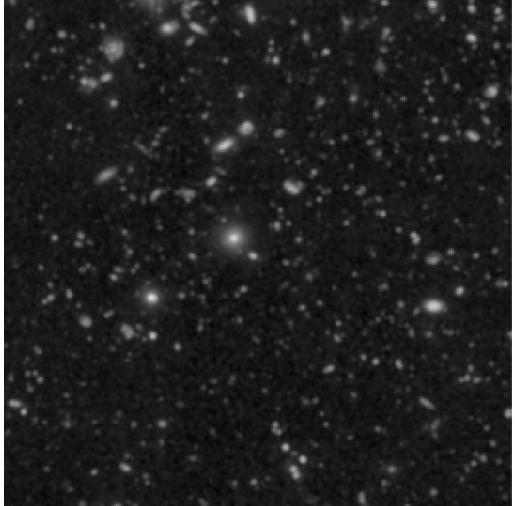
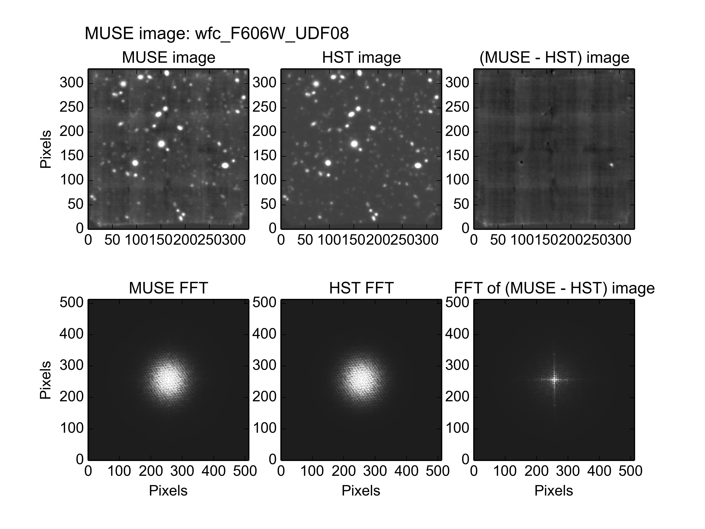
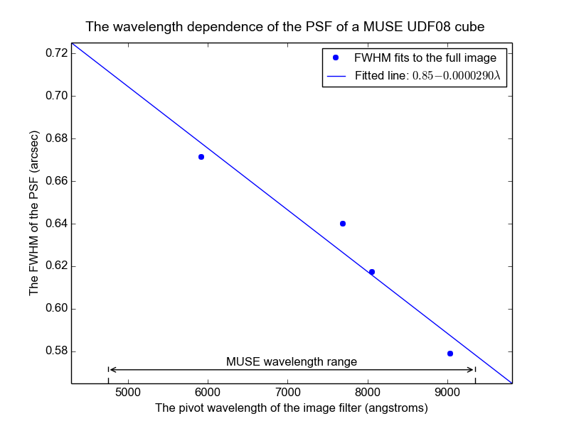

.. _UDF08:

The photometry of MUSE field UDF08
==================================

Muse field UDF08 is a 1x1 arc-minute field centered at Right Ascension
03:32:35, and declination -27:47:58, within the Hubble UDF. The HST
image of this region, seen through the F606W filter and resampled onto
the pixel grid of the MUSE images of UDF08, is shown below.

This field contains no stars or other bright point sources, so its
photometric parameters can only be fit using the global image fitting
method. When a fit is performed using the F606W HST image, the results
are as follows::

  % fit_photometry hst_F606W_for_UDF08.fits wfc_F606W_UDF08.fits --fix_beta=2.8 --hardcopy=jpeg
  # MUSE observation ID              Method    Flux    FWHM    beta      Flux  x-offset  y-offset
  #                                           scale     (")            offset       (")       (")
  #--------------------------------- ------  ------  ------  ------  --------  --------  --------
                     wfc_F606W_UDF08  image  0.9237  0.6715  2.8000   0.05970   0.01854  -0.01256

This recorded the following plot of the fitted images and their residuals:

The residual image is dominated by the instrumental background of the
original MUSE image. Apart from a couple of sources, a good fit
appears to have been obtained. The residuals of the two sources that
don't fit very well, have opposite signs. Either these two sources
varied since the HST image was taken, or more likely the
characteristics of the image in the two regions differ slightly from
the rest of the image. This could be due to a flat fielding error, for
example.

FWHM versus wavelength
----------------------

When the above fit was performed on images with the response curves of
the HST F606W, F775W, F814P, and F850LP filters, the fitted FWHMs of
the PSF had the values shown in the following plot.

The fitted FWHM values roughly follow a straight line. The plotted
line is the best fit line through them.
