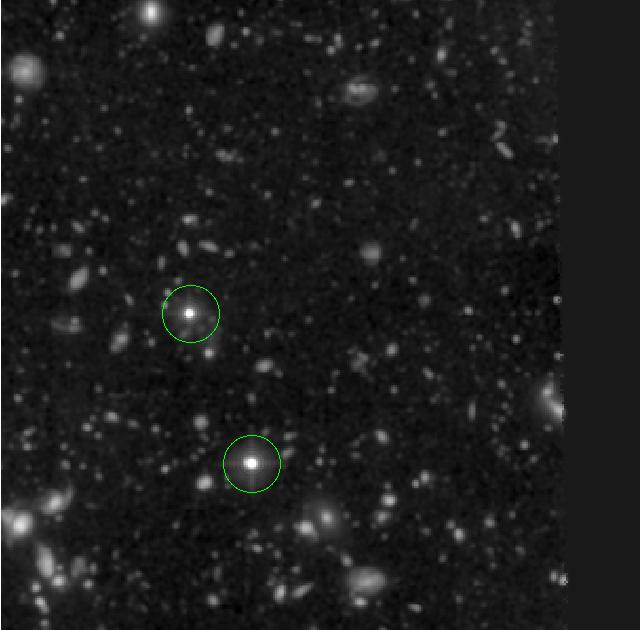
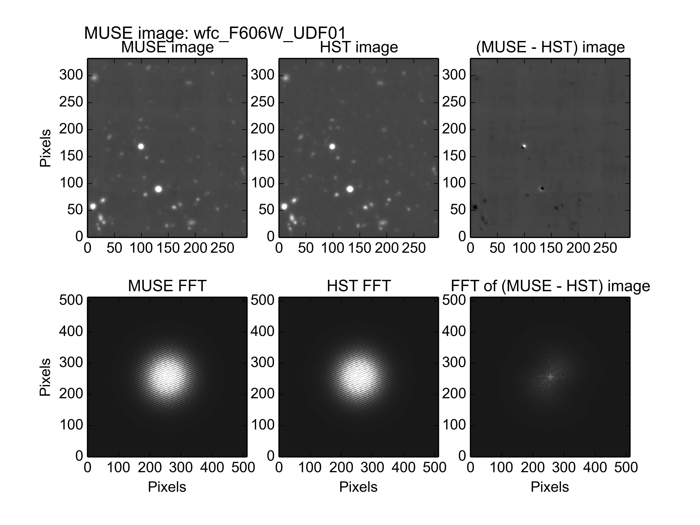
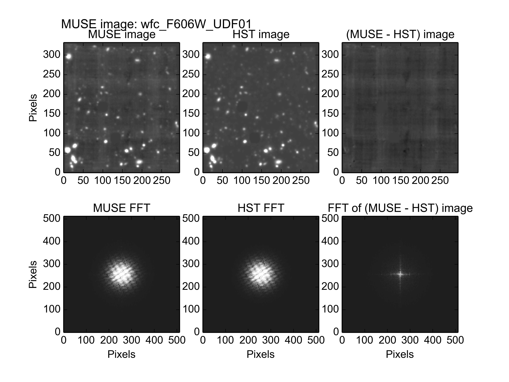
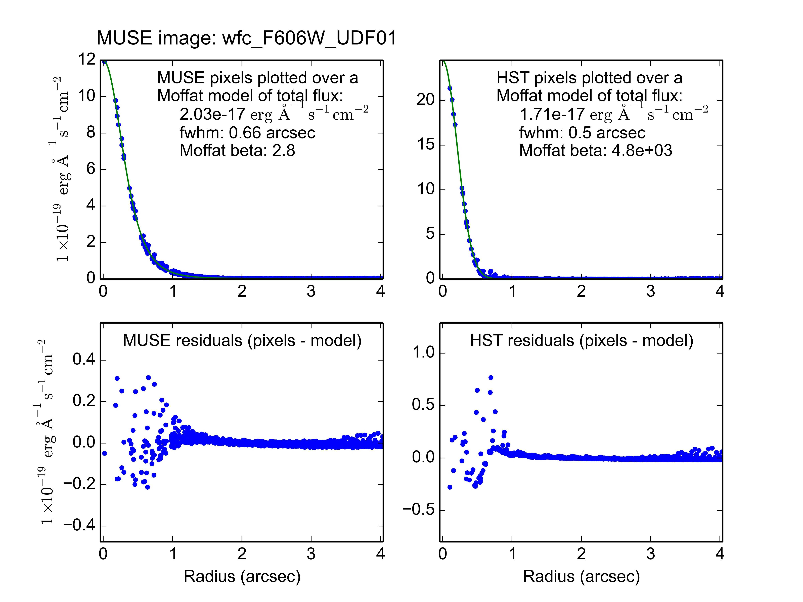
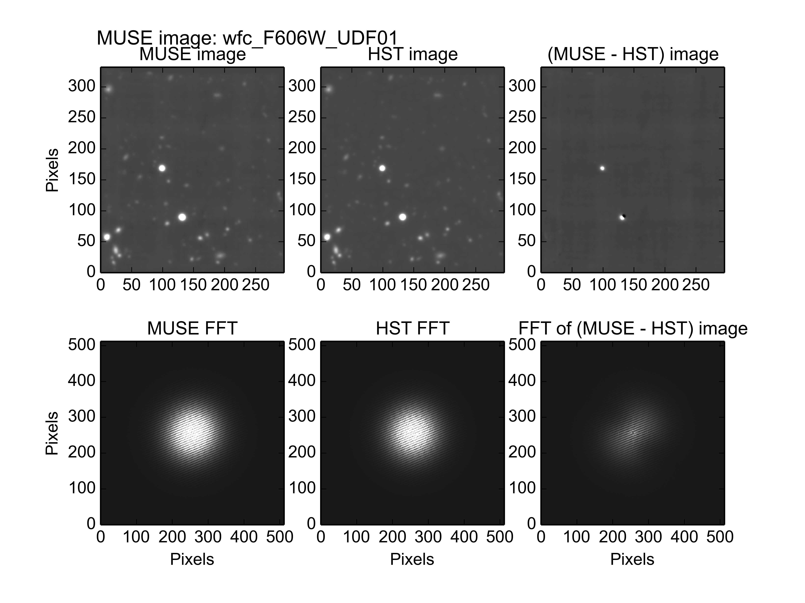
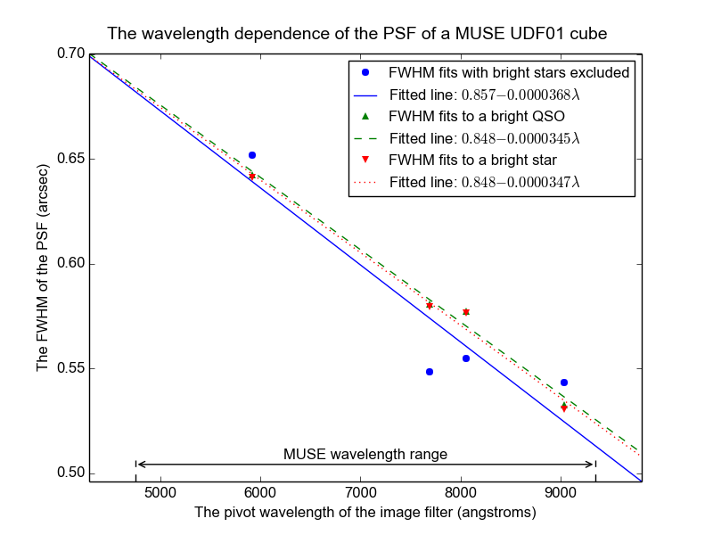

.. _UDF01:

The photometry of MUSE field UDF01
==================================

Muse field UDF01 is a 1x1 arc-minute field centered at Right Ascension
03:32:38 and declination -27:45:53, within the Hubble UDF. The HST
image of this region, seen through the F606W filter and resampled onto
the pixel grid of the MUSE images of UDF01, is shown below.

Problematic issues that affect this field
-----------------------------------------

Fitting the photometric parameters of this field turned out to be more
challenging than was initially expected. This was due to two bright
point sources, which are circled in the above image.

The first attempt to fit the photometric parameters yielded the
following unsatisfactory results for the F606W image::

  % fit_photometry hst_F606W_for_UDF01.fits wfc_F606W_UDF01.fits --fix_beta=2.8 --hardcopy jpeg
  # MUSE observation ID              Method    Flux    FWHM    beta      Flux  x-offset  y-offset
  #                                           scale     (")            offset       (")       (")
  #--------------------------------- ------  ------  ------  ------  --------  --------  --------
                     wfc_F606W_UDF01  image  1.1261  0.6557  2.8000   0.05043  -0.03945  -0.04462

In the residual image, note that the bright point sources appear to be
under-subtracted by the HST model of the MUSE image, whereas other
sources appear as small black areas that indicate that they were
over-subtracted. This implies that the flux scale factor would need to
be higher to properly fit the bright point sources, but lower to fit
the other sources in the image. This is partly due to one of the point
sources having a high proper motion, but mostly because the HST WFC
suffered flux loss for faint stars against dark backgrounds, as
described in the section on common :ref:`pitfalls<pitfalls>`.

Using the
:download:`exclude_udf_stars.reg<_static/imphot/exclude_udf_stars.reg>`
region file to mask out the two bright point sources, produced the
following fit::

  % fit_photometry hst_F606W_for_UDF01.fits wfc_F606W_UDF01.fits --fix_beta=2.8 --hardcopy jpeg --regions exclude_udf_stars.reg
  # MUSE observation ID              Method    Flux    FWHM    beta      Flux  x-offset  y-offset
  #                                           scale     (")            offset       (")       (")
  #--------------------------------- ------  ------  ------  ------  --------  --------  --------
                wfc_F606W_UDF01  image  0.9484  0.6519  2.8000   0.05713   0.01345   0.00617

The residual image looks much better now. Note that only the fitted
flux scale and X and Y position shifts significantly changed.

If instead the fit is restricted to the lower of the two star-like
sources, which is the brightest object in the image, the image and
star-profile fits are as follows::

  % fit_photometry hst_F606W_for_UDF01.fits wfc_F606W_UDF01.fits --fix_beta=2.8 --hardcopy jpeg --star 53.157969 -27.769193 4.0
  # MUSE observation ID              Method    Flux    FWHM    beta      Flux  x-offset  y-offset
  #                                           scale     (")            offset       (")       (")
  #--------------------------------- ------  ------  ------  ------  --------  --------  --------
                     wfc_F606W_UDF01  image  1.1267  0.6658  2.8000   0.10463  -0.05662  -0.06206
                     wfc_F606W_UDF01  stars  1.1927  0.6609  2.8000   0.00192  -0.06116  -0.06593

The two sets of fitted parameters are from the image-fitting algorithm
and the star-profile fitting algorithms, respectively, as are the
following plots. The fitted FWHM is similar to what was fitted before,
but the flux scale factor is significantly larger than that of the fit
to the none star-like objects, and the fitted position error is very
different.

.. image:: _static/imphot/udf01_star_image_fit.jpeg

To get some more insight into the discrepancy between the values that
were obtained on the stars, compared to those obtained on the dimmer
more diffuse sources, the following command was used. This fixes the
photometric parameters to have the values that were obtained above,
when the stars were excluded, but displays how well these fit the
image when the stars are still included::

  % fit_photometry hst_F606W_for_UDF01.fits wfc_F606W_UDF01.fits --hardcopy jpeg --fix_scale=0.9484 --fix_fwhm=0.6519 --fix_beta=2.8 --fix_bg=0.05713 --fix_dx=0.01345 --fix_dy=0.00617
  # MUSE observation ID              Method    Flux    FWHM    beta      Flux  x-offset  y-offset
  #                                           scale     (")            offset       (")       (")
  #--------------------------------- ------  ------  ------  ------  --------  --------  --------
                     wfc_F606W_UDF01  image  0.9484  0.6519  2.8000   0.05713   0.01345   0.00617

Since the fixed parameters were previously the best fits to everything
except the stars, it is no surprise that the only significant
residuals are the two stars. The upper of these two sources is clearly
under-subtracted, as though its flux at the time of the MUSE
observation, was higher than when the HST observation was made. The
residual of the lower of the two sources, however, is white on the
lower left, and black on the upper right. This implies that this star
moved towards the lower-left between the epochs of the two
observations. A search of the literature confirms that the upper
source is indeed variable, and the lower source has high proper
motion.

More specifically the upper source appears to be an AGN. In [#f1]_,
Cohen et. al reported that between 2 of the four HST UDF observing
runs, the flux of this source (UDF 9397) changed by 6%. This is much
less than the 20% discrepancy seen above, between the flux
scale-factor determined on the stars, and the scale factor fitted to
other sources. In practice, as described in the `pitfalls<pitfalls>`
section, the majority of the flux discrepancy is due to point sources
appearing dimmer than they should in HST observations, due to CCD
charge transfer losses.

In [#f2]_, Pirzkal et al reported that the lower of the two point
sources, (UDF 9230) is a star with a proper motion of about 10
mas/year. Over the roughly 11 years that separate the epoch of the HST
and MUSE observations of this field, this corresponds to a distance of
about 0.1 arcsec on the sky, which is 3 MUSE pixel widths. This turned
out to be a good estimate.  The vector difference between the fitted
pointing corrections that were obtained above when the star was
included, and when it was not included, the star appears to have moved
by 0.098 arcseconds.

In conclusion, to fit for the flux scale of MUSE images of the UDF01
field, it is best to perform the fit to the whole image, after masking
out the two point sources using a region file. The pointing error and
PSF parameters of the field can also be obtained from this fit, but
lower noise estimates of these parameters may be obtained by fitting a
Moffat profile to the QSO in UDF01.

FWHM versus wavelength
----------------------

The examples of the previous section operated on images that had the
spectral response curve of the HST F606W filter. If similar fits are
also performed to MUSE images that have the spectral response curves
of other HST filters, then the variation of the fitted FWHM of the PSF
can be obtained versus wavelength. In the following diagram, the
best-fit values of the PSF FWHM are plotted versus the pivot
wavelength of these filters. The results of 3 different sets of fits
are plotted. The first fit was to everything in the images of UDF01
except for the star and the QSO, which were excluded with a region
file. The second fit was limited to a region of 3 arcseconds radius,
centered on the QSO. The final fit was similarly limited to a circle
centered on the star in UDF01.

The FWHMs that were fitted to the star and the QSO are so similar that
their plotted values overlap. Together they trace out a straight line
versus wavelength.  The FWHMs fitted to the rest of the image are
similar, but clearly less well constrained. This may be due to a lack
of bright sources, once the star and QSO had been excluded.

.. rubric:: Footnotes

.. [#f1] *Clues to AGN Growth from Optically Variable Objects in the Hubble Ultra Deep Field*, Cohen, S. H.; Ryan, R. E., Jr.; Straughn, A. N.; Hathi, N. P.; Windhorst, R. A.; Koekemoer, A. M.; Pirzkal, N.; Xu, C.; Mobasher, B.; Malhotra, S.; Strolger, L.-G.; Rhoads, J. E., Ap. J. (2006) 639, 731

.. [#f2] *Stars in the Hubble Ultra Deep Field*, Pirzkal, N.;
         Sahu, K. C.; Burgasser, A.; Moustakas, L. A.; Xu, C.;
         Malhotra, S.; Rhoads, J. E.; Koekemoer, A. M.; Nelan, E. P.;
         Windhorst, R. A.; Panagia, N.; Gronwall, C.; Pasquali, A.;
         Walsh, J. R., Ap. J. (2005) 622, 319
