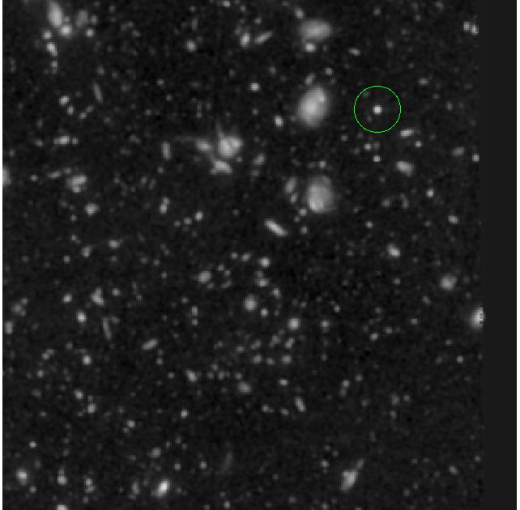
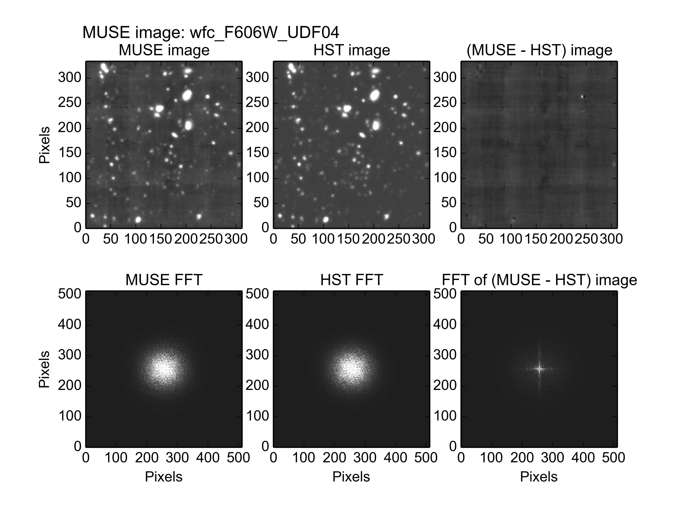
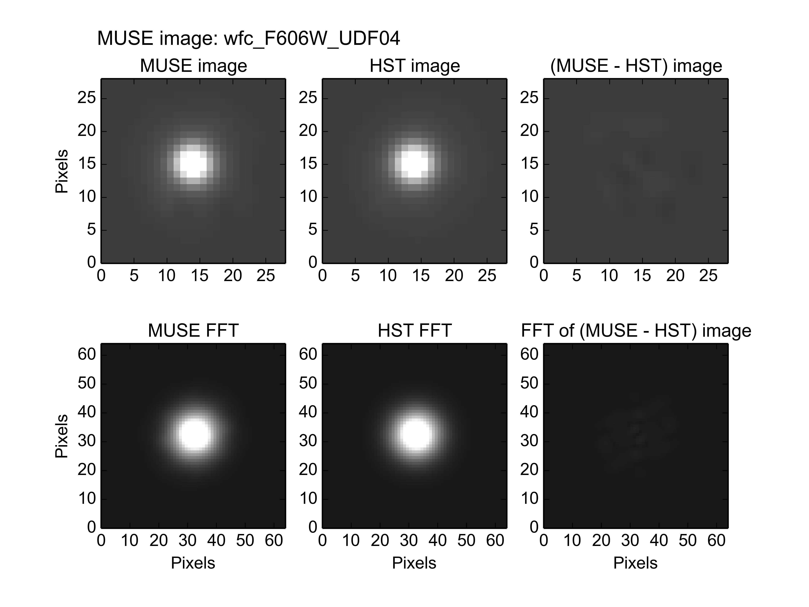
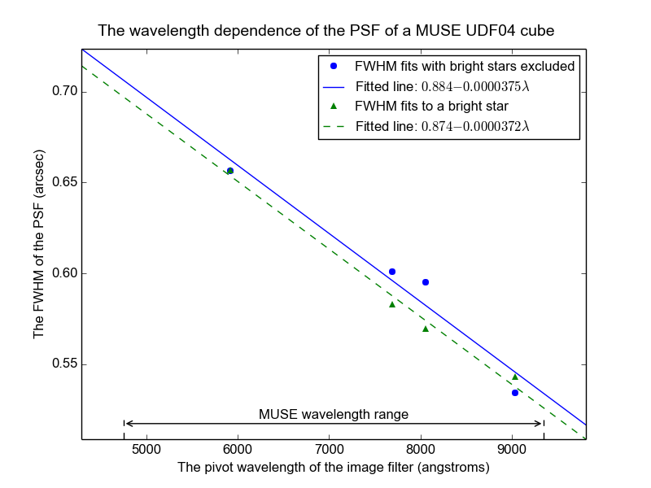

.. _UDF04:

The photometry of MUSE field UDF04
==================================

Muse field UDF04 is a 1x1 arc-minute field centered at Right Ascension
03:32:36, and declination -27:46:37, within the Hubble UDF. The HST
image of this region, seen through the F606W filter and resampled onto
the pixel grid of the MUSE images of UDF04, is shown below.

This field contains a faint star which, as described in the
:ref:`pitfalls<pitfalls>` section, should be excluded from the fit to
obtain the best fit for all other sources between the MUSE and HST
images. The output of the following command, including the plot shown
below it, show the result if the star is not excluded from the fit::

  % fit_photometry hst_F606W_for_UDF04.fits wfc_F606W_UDF04.fits --fix_beta=2.8 --hardcopy jpeg
  # MUSE observation ID              Method    Flux    FWHM    beta      Flux  x-offset  y-offset
  #                                           scale     (")            offset       (")       (")
  #--------------------------------- ------  ------  ------  ------  --------  --------  --------
                     wfc_F606W_UDF04  image  0.9566  0.6543  2.8000   0.05379   0.00742  -0.02325

The star is faint enough that the residual image is essentially empty,
except for the obvious residuals of the star in the top right corner.
If one inspects the residual image of the star closely, instead of
being circular, it appears to be elongated along the X axis, with its
left half being white and its right half being black. This implies
that the proper motion of the star was sufficient to move it visibly
towards the left of the image, in the 11 years that elapsed between
the HST observation and the MUSE observation.

If the star is excluded, by passing the
:download:`exclude_udf_stars.reg<_static/imphot/exclude_udf_stars.reg>`
region file to the :ref:`fit_photometry<fit_photometry>` script, then
the results are as follows::

  % fit_photometry hst_F606W_for_UDF04.fits wfc_F606W_UDF04.fits --regions exclude_udf_stars.reg --fix_beta=2.8 --hardcopy jpeg
  # MUSE observation ID              Method    Flux    FWHM    beta      Flux  x-offset  y-offset
  #                                           scale     (")            offset       (")       (")
  #--------------------------------- ------  ------  ------  ------  --------  --------  --------
                     wfc_F606W_UDF04  image  0.9551  0.6562  2.8000   0.05378   0.01403  -0.02274

The star is very faint, so the results with and without the star are
essentially identical, except for the fitted X-axis position error.

For completeness a final fit is performed, this time just on a region
of 3 arcseconds radius centered on the star, then the results are as
follows::

  % fit_photometry hst_F606W_for_UDF04.fits wfc_F606W_UDF04.fits --regions udf04_star.reg --fix_beta=2.8 --hardcopy jpeg
  # MUSE observation ID              Method    Flux    FWHM    beta      Flux  x-offset  y-offset
  #                                           scale     (")            offset       (")       (")
  #--------------------------------- ------  ------  ------  ------  --------  --------  --------
                     wfc_F606W_UDF04  image  1.1357  0.6569  2.8000   0.05063  -0.13132  -0.02782

The fitted parameters to the star are very similar to those of the
global image fit with the star excluded, except for the flux
scale-factor and the X-axis pointing error. The explanation for the
flux-scale discrepancy is given in the :ref:`pitfalls<pitfalls>`
section. The difference between the X-axis pointing errors given by
the global image fit and the star image fit, is an increase of 0.145
arcseconds in Right Ascension. Spread over the 11 years that ellapsed
between the HST and MUSE observations, this implies a proper motion of
about 13 mas/year, which is similar to the measurement of 12.35±0.54
mas/year that Pirkal et al (2005) reported for this star (UDF 9212) in
[#f1]_.

FWHM versus wavelength
----------------------

The examples of the previous section operated on images that had the
spectral response curve of the HST F606W filter. If similar fits are
also performed to MUSE images that have the spectral response curves
of other HST filters, then the variation of the fitted FWHM of the PSF
can be obtained versus wavelength. In the following diagram, the
best-fit values of the PSF FWHM are plotted versus the pivot
wavelength of these filters. The results of 2 different sets of fits
are plotted. The first fit was to everything in the images of UDF04
except for the faint star, which was excluded with a region file. The
second fit was limited to a region of 3 arcseconds radius, centered on
the star.

The FWHMs that were fitted to the stellar image and to the image
without the star, are very similar, and the best fit lines to the two
images are separated by 0.008 arcsec. This gives some idea of the
uncertainty in the fitted FWHMs and their behavior versus wavelength.

.. rubric:: Footnotes

.. [#f1] *Stars in the Hubble Ultra Deep Field*, Pirzkal, N.;
         Sahu, K. C.; Burgasser, A.; Moustakas, L. A.; Xu, C.;
         Malhotra, S.; Rhoads, J. E.; Koekemoer, A. M.; Nelan, E. P.;
         Windhorst, R. A.; Panagia, N.; Gronwall, C.; Pasquali, A.;
         Walsh, J. R., Ap. J. (2005) 622, 319
