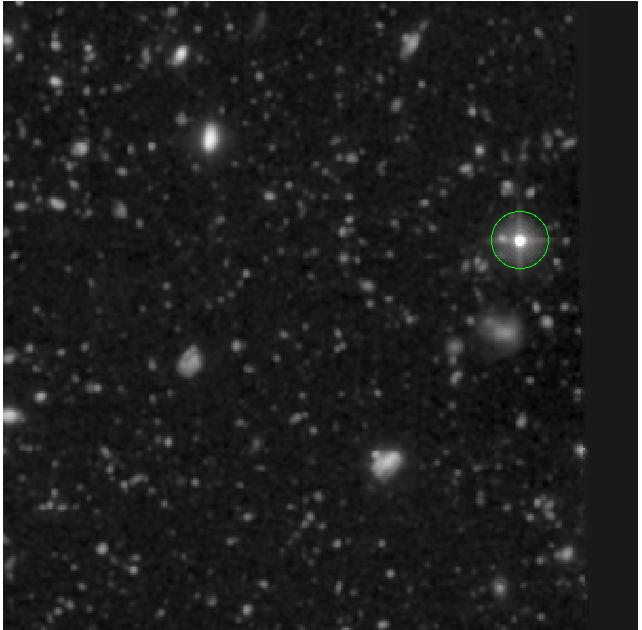
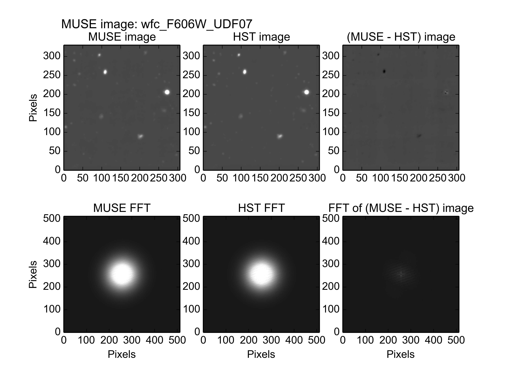
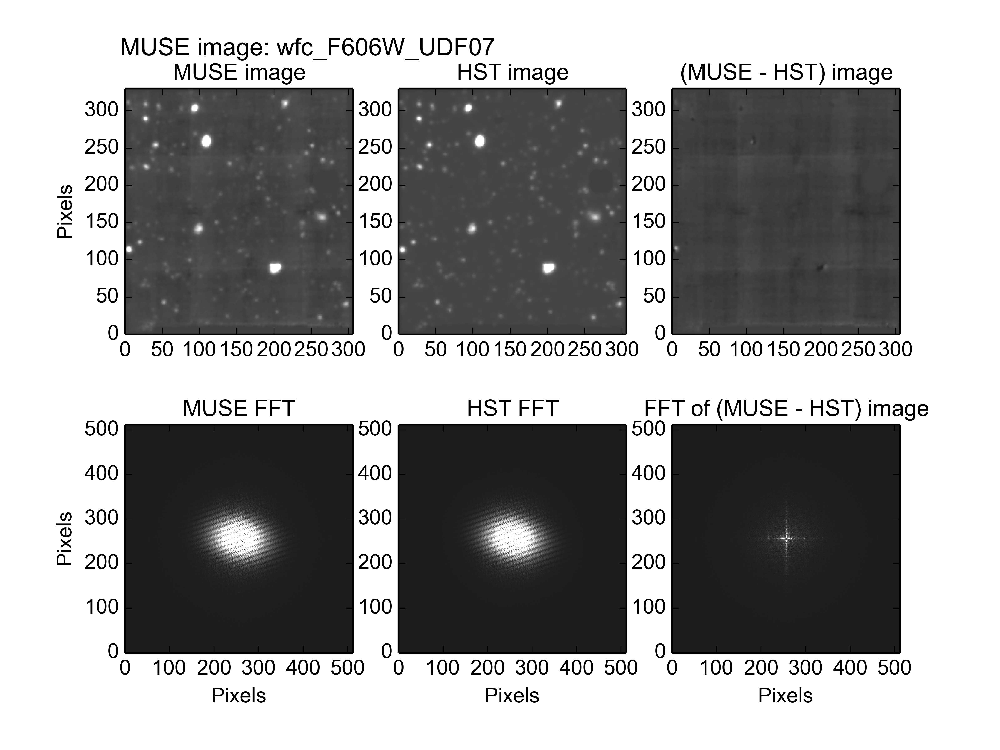
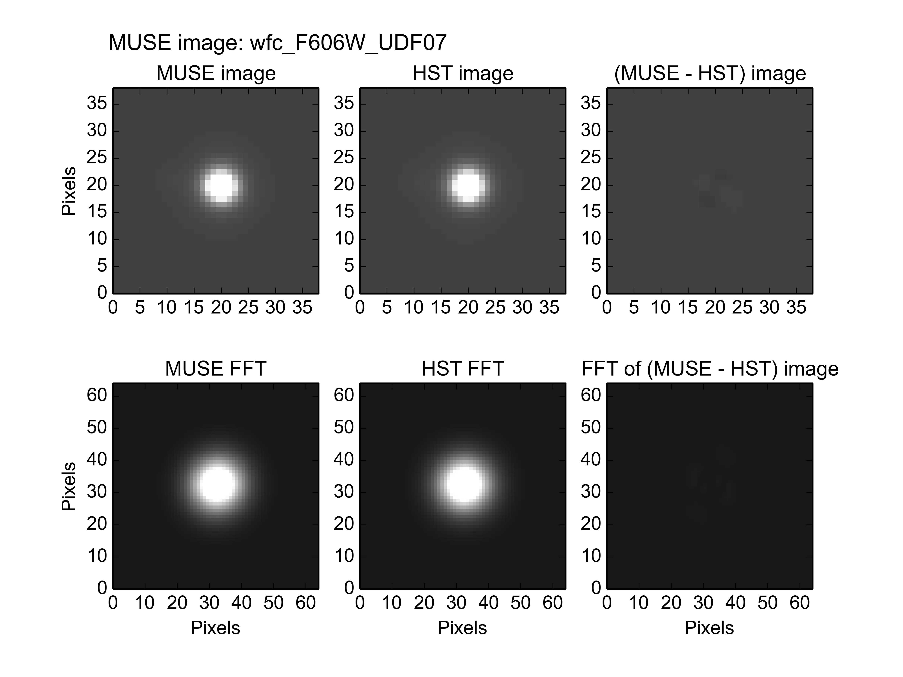
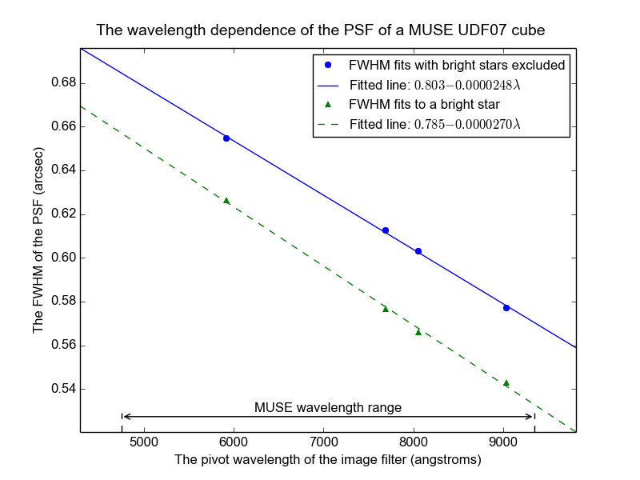

.. _UDF07:

The photometry of MUSE field UDF07
==================================

Muse field UDF07 is a 1x1 arc-minute field centered at Right Ascension
03:32:33, and declination -27:47:18, within the Hubble UDF. The HST
image of this region, seen through the F606W filter and resampled onto
the pixel grid of the MUSE images of UDF07, is shown below.

This field contains a bright star which should be excluded from the
fit to obtain a good fit for all other sources between the MUSE and
HST images, as described in the :ref:`pitfalls<pitfalls>` section. The
output of the following command, including the plot shown below it,
show the poor fit that is obtained if the star is not excluded from
the fit::

  % fit_photometry hst_F606W_for_UDF07.fits wfc_F606W_UDF07.fits --fix_beta=2.8 --hardcopy jpeg
  # MUSE observation ID              Method    Flux    FWHM    beta      Flux  x-offset  y-offset
  #                                           scale     (")            offset       (")       (")
  #--------------------------------- ------  ------  ------  ------  --------  --------  --------
                     wfc_F606W_UDF07  image  1.1583  0.6244  2.8000   0.04888   0.00633   0.00765

With the bright star included in the fit, the residual image indicates
a very poor fit, due to the HST stellar flux-loss problem, described
in the :ref:`pitfalls<pitfalls>` section. Unlike other MUSE UDF fields
with stars in them, there is no evidence that the proper motion of the
star has misaligned the image for the other sources, so this implies
that it has a low proper motion. If the star is excluded, then the fit
improves, as follows::

  % fit_photometry hst_F606W_for_UDF07.fits wfc_F606W_UDF07.fits --regions=exclude_udf_stars.reg --fix_beta=2.8 --hardcopy jpeg
  # MUSE observation ID              Method    Flux    FWHM    beta      Flux  x-offset  y-offset
  #                                           scale     (")            offset       (")       (")
  #--------------------------------- ------  ------  ------  ------  --------  --------  --------
                     wfc_F606W_UDF07  image  0.9824  0.6548  2.8000   0.05633   0.00953  -0.05440

The residual image is dominated by the instrumental background of the
original MUSE image, so it appears to be a good fit. A slightly better
looking residual image can be obtained by modifying the region file to
exclude overlapping margins of the UDF04 and UDF08 fields, but the
fitted numbers don't change significantly.

Another estimate of the PSF of the image can be obtained by performing
an image fit to a small area centered on the star. This has the
following results::

  % fit_photometry hst_F606W_for_UDF07.fits wfc_F606W_UDF07.fits --regions=udf07_star.reg --fix_beta=2.8 --hardcopy jpeg
  # MUSE observation ID              Method    Flux    FWHM    beta      Flux  x-offset  y-offset
  #                                           scale     (")            offset       (")       (")
  #--------------------------------- ------  ------  ------  ------  --------  --------  --------
                     wfc_F606W_UDF07  image  1.1708  0.6263  2.8000   0.11258   0.00614   0.00829

The amount that the star moved relative to the other sources in the
image, can be estimated by taking the vector difference between the
fitted pointing errors to the image without the star, and the image of
the star. This yields a value of 0.06±0.08 arcsec, where the
uncertainty was estimated using the errors on the fitted position
offsets, which can be obtained using the ``--verbose`` option of the
:ref:`fit_photometry<fit_photometry>` script. In other words its
accumulated proper motion over the 11 years between the HST and UDF
observations of this field, was too small to measure within the
resolution of MUSE. In [#f1]_ by Pirkal et al (2005), the proper
motion of this star (UDF 5921) was reported as being 3.27±1.26
mas/year. Over the 11 years between the observations, this should have
moved the star by 0.04 arcseconds, which is comfortably within our
estimate.

FWHM versus wavelength
----------------------

The examples of the previous section operated on images that had the
spectral response curve of the HST F607W filter. If similar fits are
also performed to MUSE UDF07 images that have the spectral response
curves of other HST filters, then the variation of the fitted FWHM of
the PSF can be obtained versus wavelength. In the following diagram,
the best-fit values of the PSF FWHM are plotted versus the pivot
wavelength of these filters. The results of 2 different sets of fits
are plotted. The first fit was to everything in the UDF07 images
except for the bright star, which was excluded with a region file. The
second fit was limited to a region of 3 arcseconds radius, centered on
the star.

There is an obvious offset of about 0.03 arcseconds between the FWHM
values fitted to the image with the star excluded, and the FWHM values
fitted to the stellar image. The origin of this offset is not yet
known, and both sets of fits lie as closely along a straight line as
each other, so there is no hint of one being better behaved than the
other. One possibility is that because the star is much brighter than
anything else in the image, the stacked exposures that contributed to
this image are probably better aligned for the star than for anything
else in the image. That would make its FWHM narrower than other
sources. This would be especially true for sources further from the
star if there was any residual field rotation between successive
exposures. Hopefully the discrepancy will disappear as the algorithms
used to align exposures improve.

.. rubric:: Footnotes

.. [#f1] *Stars in the Hubble Ultra Deep Field*, Pirzkal, N.;
         Sahu, K. C.; Burgasser, A.; Moustakas, L. A.; Xu, C.;
         Malhotra, S.; Rhoads, J. E.; Koekemoer, A. M.; Nelan, E. P.;
         Windhorst, R. A.; Panagia, N.; Gronwall, C.; Pasquali, A.;
         Walsh, J. R., Ap. J. (2005) 622, 319

