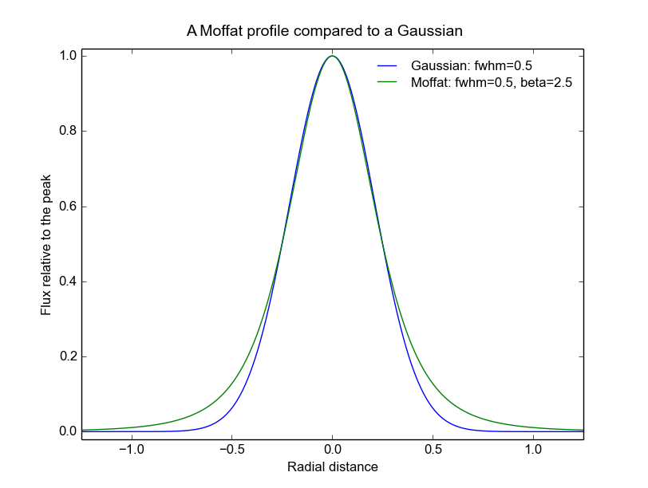

.. _fit_photometry:

Fitting for the photometric parameters of MUSE images
=====================================================

The photometric parameters of one or more MUSE exposures of a field
can be fit either using the :ref:`fit_photometry<fit_photometry>` script, or via one or
more provided python functions. The command-line options of the
:ref:`fit_photometry<fit_photometry>` script can be seen by passing it the ``-h`` argument::

  % fit_photometry -h
  usage: fit_photometry [-h] [--regions file-star-notstar-or-none]
                        [--star ra dec radius] [--segment] [--fix_scale factor]
                        [--fix_bg offset] [--fix_dx arcsec] [--fix_dy arcsec]
                        [--fix_fwhm arcsec] [--fix_beta value]
                        [--hst_fwhm arcsec] [--hst_beta value] [--margin arcsec]
                        [--save] [--display] [--nowait]
                        [--hardcopy format-or-none] [--title text] [--verbose]
                        hst_image muse_images [muse_images ...]

  positional arguments:
    hst_image             The name of the FITS file containing the reference
                          HST image. This must have been decimated and
                          resampled onto the same coordinate grid as the MUSE
                          images. The HST bandpass filter used to obtain this
                          image should match the bandpass of the MUSE images as
                          closely as possible. Note that the `regrid_hst_to_muse`
                          script or the `mpdaf.obj.Image.align_with_image()`
                          function can be used create a subimage of an HST
                          image that has the same coordinate grid as a MUSE
                          image.
    muse_images           One or more FITS files containing MUSE images.  These
                          should all be images of the same field and bandpass
                          as the HST image named by the --hst argument. Note
                          that the `make_wideband_image` script or the
                          `mpdaf.obj.Cube.bandpass_image()` can be used to
                          extract an image of a given HST bandpass from a MUSE
                          cube.

  optional arguments:
    -h, --help            show this help message and exit
    --regions file-star-notstar-or-none
                          DEFAULT=star

                          This can be "none", to indicate that all pixels
                          should be used in the global image fit, "star" to
                          restrict the fit to pixels within any optional circle
                          defined by the --star argument, "notstar" to restrict
                          the image fit to pixels outside any circle defined by
                          the --star argument, or the filename of a ds9 region
                          file.

                          This option can be used to exclude damaged regions of
                          an image, or to exclude sources that would degrade
                          the global PSF fit, such as saturated stars, stars
                          with significant proper motion, or variable sources.

                          Alternatively this option can also be used to
                          restrict the fit to one or more objects, by masking
                          everything except small regions around these objects.

                          Only ds9 circle, ellipse and box regions are
                          supported. Other types of ds9 regions and
                          configuration parameters, are simply ignored. For
                          each region, be careful to tell ds9 whether you want
                          the region to be included or excluded. Also be
                          careful to specify either fk5 or physical pixel
                          coordinates.

                          If the value of this argument is "star", and the
                          --star argument has also been provided, then a region
                          is substituted that only includes the circular region
                          specified by the --star argument.

                          Similarly, if "notstar" is passed, and the --star
                          argument has been provided, then a region is
                          substituted that excludes the circular region set by
                          the --star argument.
    --star ra dec radius  DEFAULT=None
                          Perform photometry fits to a star at a specified
                          position. This is done in addition to the global
                          image fitting procedure, so two sets of
                          photometry results are reported when this option
                          is selected.

                          The option expected 3 values. These are the right
                          ascension and declination of the star in decimal
                          degrees, and the radius of the area over which to
                          perform the fit, in arcseconds.

                          If the --regions argument is also present, and
                          its value is the word "star", then the imaging
                          fitting procedure is also restricted to the
                          region of this star. This can be used as a
                          consistency check, as both methods should yield
                          similar results.
    --segment             Ignore areas that don't contain significant objects
                          by ignoring pixels that are below the median value in
                          a morphologically opened version of the HST image.
    --fix_scale factor    DEFAULT=None
                          Use this option to fix the calibration scale
                          factor, (MUSE_flux / HST_flux) to the specified
                          value while fitting. The default value is "none",
                          which means that the parameter will be fitted.
    --fix_bg offset       DEFAULT=None
                          Use this option to fix the calibration zero-offset
                          (MUSE_flux - HST_flux) to the specified value while
                          fitting. The default value is "none", which means
                          that the parameter will be fitted.
    --fix_dx arcsec       DEFAULT=None (arcseconds)
                          Use this option to fix the x-axis pointing offset,
                          (MUSE_x - HST_x) to the specified value while
                          fitting. The default value is "none", which means
                          that the parameter will be fitted.
    --fix_dy arcsec       DEFAULT=None (arcseconds)
                          Use this option to fix the y-axis pointing offset,
                          (MUSE_y - HST_y) to the specified value while
                          fitting. The default value is "none", which means
                          that the parameter will be fitted.
    --fix_fwhm arcsec     DEFAULT=None (arcseconds)
                          Use this option to fix the FWHM of the Moffat PSF
                          to the specified value while fitting. The default
                          value is "none", which means that the parameter
                          will be fitted.
    --fix_beta value      DEFAULT=2.5
                          Use this option to fix the beta exponent of the
                          Moffat PSF to the specified value while fitting.
                          The default value is 2.5. Change this to "none"
                          if you wish this parameter to be fitted.
    --hst_fwhm arcsec     DEFAULT=0.085 (arcseconds)
                          The FWHM of a Moffat model of the effective PSF of
                          the HST. The default value that is used if this
                          parameter is not specified, came from Moffat fits to
                          stars within HST UDF images. To obtain the closest
                          estimate to the dithered instrumental PSF, these fits
                          were made to images with the smallest available pixel
                          size (30mas).
    --hst_beta value      DEFAULT=1.6
                          The beta parameter of a Moffat model of the effective
                          PSF of the HST.  The default value that is used if
                          this parameter is not specified, came from Moffat
                          fits to stars within HST UDF images, as described
                          above for the hst_fwhm parameter.
    --margin arcsec       DEFAULT=2.0 (arcseconds)
                          The width of a margin of zeros to add around the
                          image before processing. A margin is needed because
                          most of the processing is performed using discrete
                          Fourier transforms, which are periodic in the width
                          of the image. Without a margin, features at one edge
                          of the image would spill over to the opposite edge of
                          the image when a position shift was applied, or when
                          features were widened by convolving them with a
                          larger PSF. The margin width should be the maximum of
                          the largest expected position error between the two
                          input images, and the largest expected PSF width.
    --save                Save the result images of each input image to FITS
                          files.
    --display             Display the images, FFTs and star fits, if any.
    --nowait              Don't wait for the user to interact with each
                          displayed plot before continuing.
    --hardcopy format-or-none
                          Write hardcopy plots of the fitting results to files
                          that have the specified graphics format (eg. "pdf",
                          "jpg", "png", "eps").  Plots of the fits will be
                          written to filenames that start with the name of the
                          MUSE input file, after removing any .fits suffix,
                          followed by either "_image_fit.<suffix>" for the plot
                          of the image fit, or "_star_fit.<suffix>" for plots
                          of any star fits.
    --title text          DEFAULT=None
                          Either a plot title, "none" to request the default
                          title, or "" to request that no title be displayed
                          above the plots.
    --verbose             Report details of each fit, including chi-squared,
                          correlations, etc. Normally only summaries of the
                          fitted parameters are displayed.
  %

General Usage
-------------

The :ref:`fit_photometry<fit_photometry>` script fits for the
photometric parameters of one or more MUSE images of a field. It does
this by convolving a specified HST image of the same field, with a PSF
that best reproduces the resolution of the MUSE image; also by scaling
and offsetting its fluxes with numbers that best reproduce the fluxes
of the MUSE image, and finally also by shifting the position of the
HST image by a vector amount that best lines up features in the two
images. The fitting process is undertaken in the Fourier plane, where
convolution and image shifts are simple multiplications. The goodness
of the fit is likewise determined by comparing corresponding pixels of
the FFTs of the MUSE image and the HST image.

By default, the script performs the above procedure on each of the
MUSE images in turn, and reports a summary of the fitted photometry
parameters. A more verbose report of the fit results can be requested
using the ``--verbose`` option. When there are multiple MUSE images to
be fit, the script automatically distributes the work between multiple
processes to make it more efficient on multi-processor computers. The
results are always reported in the order that the MUSE images are
given on the command-line, regardless of the order in which they are
actually completed in the different processes.

.. _plotting_options:

Plotting options
----------------

By adding the :ref:`--display<plotting_options>` option, the script
can be asked to plot the pre-processed MUSE and HST images and the
best-fit images, along with their FFTs. By default, these plots wait
for the user to interact with them and dismiss them, before the
fitting process resumes. Alternatively, the
:ref:`--nowait<plotting_options>` option makes the plots
non-interactive. In this case they disappear automatically as soon as
the script ends, or as soon as a new plot is plotted, such as a star
plot (see below), or the plots of a subsequent MUSE image.

Beware that the plots are generated and displayed by the background
worker processes, as the fits are completed. This means that when
multiple MUSE files are being processed, there may be many plots
displayed simultaneously. It also means that the plots may be
displayed in a different order to the textual results, which are
reported in the order that the images are given on the command
line. As such, it is better to restrict the use of the
:ref:`--display<plotting_options>` option to when only one MUSE image
is being processed by the :ref:`fit_photometry<fit_photometry>`
script. Alternatively, the plots can be saved as PDF files for later
inspection, by using the :ref:`--hardcopy<plotting_options>` option
instead of the :ref:`--display<plotting_options>` option.

.. _regions:

Regions
-------

By default the :ref:`fit_photometry<fit_photometry>` script performs a
global fit between an HST image and each MUSE image. However sometimes
it is better to restrict the fit to a bright star. At other times it
can be better to fit to everything *except* a bright object that is
confusing the fit, such as an object that has changed in position or
in flux since the HST image was taken. This is the purpose of the
``--regions`` argument.

The ``--regions`` argument has three possible arguments:

none

   This tells :ref:`fit_photometry<fit_photometry>` to perform the fit
   to all the pixels of the MUSE and HST images.

star

   This is described in more detail under :ref:`star_fitting`. It tells the
   script to restrict the fit to a region of pixels defined by the
   ``--star`` argument.

*filename*

   This should be the name of a ds9 region file. Ds9 region files are
   generated by the ubiquitous ds9 FITS viewing program. The simplest
   way to generate a suitable file is to run ds9 on either a MUSE
   exposure, or the corresponding HST image.

   The ds9 program can be used to interactively select regions of
   various shapes, and save the resulting shapes to a ds9 region
   file. Of the available shapes, only the circle, ellipse and box
   shapes are supported by
   :ref:`fit_photometry<fit_photometry>`. Other regions that are found
   in regions files by :ref:`fit_photometry<fit_photometry>` are
   simply ignored. The :ref:`fit_photometry<fit_photometry>` script
   also heeds the ``fk5`` and ``physical`` coordinate system
   designators. If no coordinate system designator is found before the
   first region definition, that region is assumed to be specified in
   ``physical`` coordinates, which are FITS 1-relative pixel
   indexes. Other coordinate systems, such as B1950, are recognized,
   but they elicit an error message from
   :ref:`fit_photometry<fit_photometry>` and terminate the script.

   By default, ds9 creates *include* regions. For example, an circular
   *include* region indicates that
   :ref:`fit_photometry<fit_photometry>` should restrict its fitting
   process to the interior of the circular region. Alternatively, ds9
   can be asked subsequently create *exclude* regions by pulling down
   the Region menu and selecting ``Exclude`` from the ``Properties``
   sub-menu. Note that ds9 distinguishes excluded regions from
   included regions by drawing a red diagonal line across them.

   In :ref:`fit_photometry<fit_photometry>` if all of the regions in a
   region file are *include* regions, then the fit will be restricted
   to the pixels within those regions.

   Alternatively, if all of the regions are *exclude* regions, then
   the fit will be restricted to all of the image pixels *except* for
   those within the excluded regions.

   If the region file contains both *include* and *exclude* regions,
   then the fit is performed on all pixels that are outside the
   excluded regions, plus any pixels that are within both the included
   and excluded regions.

   Region files can also be generated by hand or automatically by a
   python script. For example, a file that is given the following
   contents::

     fk5; circle(53.157969, -27.769193, 2.5")

   This would tell :ref:`fit_photometry<fit_photometry>` to only
   perform the imaging fit to pixels within 2.5 arcseconds of a point
   at an fk5 Right Ascension and declination of 53.157969, -27.769193
   degrees respectively. This line is actually the contents of a
   region file that is used for selecting a small region around a
   bright star in the MUSE UDF01 field. Carefully note the ``"`` after
   the 2.5 at the end of the line. This character indicates that the
   radius of the circle is 2.5 arcseconds. Without this character, the
   radius would be assumed to be in degrees.

   The above line restricts the fit to an area around a star. To
   alternatively exclude the same area, so that the fit is performed
   to all pixels except those of the star, the file could instead
   contain the following line::

     fk5; -circle(53.157969, -27.769193, 2.5")

   Note the minus sign before the shape name. This is what indicates
   that a region should be excluded from the fit. For completeness,
   the contents of the following region file would exclude two bright
   stars from the fit::

     fk5
     -circle(53.157969, -27.769193, 2.0")
     -circle(53.162822, -27.767150, 2.0")

.. _udf_region_files:

Region files for the MUSE UDF fields
------------------------------------

The following region files are provided for use with the MUSE
UDF fields.

.. _UDF01.reg: _static/UDF01.reg
.. _UDF04.reg: _static/UDF04.reg
.. _UDF05.reg: _static/UDF05.reg
.. _UDF06.reg: _static/UDF06.reg
.. _UDF07.reg: _static/UDF07.reg

   +-----------+-----------------------------------+-------------+
   |UDF field  |  Purpose                          | Region file |
   +===========+===================================+=============+
   | UDF01     | Limit the fit to a bright star    | UDF01.reg_  |
   +-----------+-----------------------------------+-------------+
   | UDF04     | Exclude a source that doesn't fit | UDF04.reg_  |
   +-----------+-----------------------------------+-------------+
   | UDF05     | Limit the fit to a bright star    | UDF05.reg_  |
   +-----------+-----------------------------------+-------------+
   | UDF06     | Limit the fit to a bright star    | UDF06.reg_  |
   +-----------+-----------------------------------+-------------+
   | UDF07     | Exclude a source that doesn't fit | UDF07.reg_  |
   +-----------+-----------------------------------+-------------+

.. _star_fitting:

Star fitting
------------

As described above under :ref:`regions`, one way to restrict the
fitting process to a single star, is to use the ``--regions`` option
to specify a region that excludes all of the image from the fit, apart
from a small area around the star. However the
:ref:`--star<star_fitting>` option provides a more convenient way to
do this that doesn't require the creation of a region file. It also
selects a second form of photometry fitting, specific to stars.

The :ref:`--star<star_fitting>` option takes 3 arguments which define
a circular region around the position of a star. These are the Right
Ascension and Declination of the center of the region, in degrees, and
the radius of the region in arcseconds. By default this elicits two
changes to the way that :ref:`fit_photometry<fit_photometry>`
proceeds:

1. If the :ref:`--regions<regions>` parameter has the value ``star``
   (the default), then the image fit is limited to pixels *inside* the
   circular region specified to the :ref:`--star<star_fitting>`.

   Alternatively, if the :ref:`--regions<regions>` parameter has the
   value ``notstar``, then the image fit is limited to pixels *outside*
   the circular region specified to the :ref:`--star<star_fitting>`.

   Finally, if the :ref:`--regions<regions>` parameter has the value
   ``none`` or is given the name of a ds9 region file, then the image
   fitting procedure proceeds as though the
   :ref:`--star<star_fitting>` argument had not been specified.

2. In addition to the above changes, the :ref:`--star<star_fitting>`
   option also elicits a second photometric fitting method, which
   provides an independent estimate of the photometric parameters.

   This algorithm separately fits Moffat profiles to a given star in
   the MUSE image and the HST image. The final reported values for the
   PSF of the MUSE image are the fitted FWHM and beta values of the
   Moffat profile in the MUSE image. The reported value for the flux
   scale-factor is the ratio of the integrated Moffat fluxes fitted in
   the MUSE and HST images. Similarly, the reported flux zero-offset
   is the difference between the zero-offsets of the MUSE and HST
   Moffat fits, and the pointing offset of the MUSE image is the
   difference between the centroids of the fitted Moffat profiles in
   the two images.

The results of the normal image fitting algorithm and the star fitting
algorithm are reported one after another. Similarly, when the
:ref:`--display<plotting_options>` and/or
:ref:`--hardcopy<plotting_options>` options are selected, separate
plots are displayed for the image fitting technique and for the
star-profile fitting technique.

.. _fitted_parameters:

The fitted parameters
---------------------

The fitted parameters are named as follows:

   +-----------+----------------------------------------+
   | Parameter | Description                            |
   +===========+========================================+
   | fwhm      | The PSF full-width at half-maximum     |
   +-----------+----------------------------------------+
   | beta      | The PSF Moffat beta value              |
   +-----------+----------------------------------------+
   | scale     | The flux scale  (MUSE_flux / HST_flux) |
   +-----------+----------------------------------------+
   | bg        | The flux offset (MUSE_flux - HST_flux) |
   +-----------+----------------------------------------+
   | dx        | The X-axis offset (MUSE_x - HST_x)     |
   +-----------+----------------------------------------+
   | dy        | The Y-axis offset (MUSE_y - HST_y)     |
   +-----------+----------------------------------------+

Note that the MUSE PSF is modeled as a 2D Moffat function. A 2D Moffat
profile with a total integrated flux of 1, is defined as follows

.. math::  m(x,y) = \frac{\beta - 1} { \pi \alpha^2 (1 + (x^2 + y^2) / \alpha^2)^\beta}

In this equation, :math:`\beta` is the beta parameter listed as one
of the fitted parameters, and :math:`\alpha` can be calculated from
the FWHM, :math:`w`, as:

.. math:: \alpha = \frac{0.5 w}{\sqrt{2^{1/\beta} - 1}}

The following figure shows a comparison of a Moffat profile of
:math:`\beta=2.5` to a Gaussian profile of the same FWHM:

In general, near the peak of the PSF, Moffat profiles are similar to
Gaussian profiles. However they have wider wings, as can be seen in
the plot. As beta increases, the strength of the wings steadily
decreases and the function becomes more and more like a Gaussian.

.. _fixing_parameters:

Indicating which parameters are to be fitted
--------------------------------------------

For each photometric parameter, *par*, there is a corresponding option
called --\fix_\ *par*\ . If this option is assigned a floating point
value, then the parameter *par* is held at that value during the
least-squares fitting process. For example, to force the Moffat beta
parameter to have a value of 2.8, one would use ``--fix_beta=2.8``,
whereas to let it vary during the fit, one would use
``--fix_beta=none``.

By default, the fwhm, scale, bg, dx and dy parameters are fitted, but
the beta parameter is held at the value 2.5.  This is done because
there is significant covariance between this parameter and other
parameters in the fit, and it is easier to obtain a smooth trend in
the fitted FWHM value versus wavelength if the beta value is
constrained to the same value in all of the fits. Star profile fits
indicate that common values of beta in MUSE images are between about
2.2 and 3.0, depending on the seeing conditions. The restriction on
beta can be removed, as described below, by adding the option
`--fix_beta=none`. Alternatively, it can be fixed to another value.
